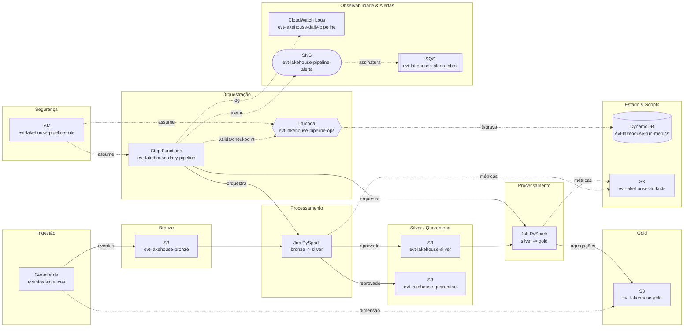

# Lakehouse de Eventos de Pagamento — contrato de dados, Step Functions e CI/CD

[](https://github.com/carlosr-data2/lakehouse-de-eventos-de-pagamento-com-contrato-de-dados/actions/workflows/ci.yml)

Pipeline de dados ponta a ponta construído a partir dos requisitos de uma vaga real de **Engenheiro de Dados Sênior**: arquitetura medallion (bronze/silver/gold) com quarentena, contrato de dados explícito, processamento em PySpark, orquestração serverless com Step Functions e CI em três estágios — tudo rodando **100% local e sem custo** via LocalStack, com o mesmo Terraform que subiria na AWS real.

## O que este projeto demonstra

- **Pipeline como produto de software**: infraestrutura 100% declarada em Terraform, lógica de negócio testável sem cluster, CI que provisiona a infra do zero a cada push.
- **Contrato de dados com quarentena**: o que reprova na validação não é descartado — vai pra quarentena com o motivo gravado.
- **Separação plano de controle / plano de dados**: quem orquestra (Step Functions + Lambda) não é quem processa (Spark).
- **Decisões com trade-off explícito**: Step Functions vs Airflow (a DAG equivalente está em [`airflow/`](airflow/)), PySpark puro vs GlueContext, LocalStack como prática de DataOps.

## Arquitetura



## Decisões de arquitetura

| Decisão | Alternativa rejeitada | Por quê |
|---|---|---|
| PySpark puro, sem GlueContext/DynamicFrame | Recursos nativos do Glue (bookmarks, resolveChoice) | Portabilidade total: o mesmo job roda em Glue, EMR, EMR Serverless, Databricks e no container local — alavanca real de FinOps |
| Step Functions para orquestração | Airflow | Pipeline AWS-nativo com retry/backoff declarativo e zero infra pra manter; a comparação concreta está em [`airflow/dag_evt_lakehouse.py`](airflow/dag_evt_lakehouse.py) |
| Quarentena como área de primeira classe | Descartar/corrigir reprovados em silêncio | Dado descartado silenciosamente é o jeito mais rápido de perder confiança no lakehouse |
| LocalStack para todo o ciclo local e CI | Conta AWS de desenvolvimento | Ambiente descartável, idêntico na forma dos recursos, custo zero, feedback em segundos |

A justificativa completa de cada decisão está no [roteiro de construção](docs/ROTEIRO.md).

## Estrutura do repositório

```
infra/       Terraform: buckets, IAM, DynamoDB, Lambda, SNS/SQS e a máquina de estados
lambda/      Plano de controle: validações, checkpoint de métricas e notificação
ingest/      Gerador de eventos sintéticos e ingestão na camada bronze
jobs/        Jobs PySpark (bronze→silver com contrato/quarentena, silver→gold) — funções puras, testáveis
tests/       Testes unitários do contrato de dados (pytest, SparkSession local, sem infra)
sql/         Consultas de validação e DDL de exposição para Redshift
airflow/     DAG equivalente à máquina de estados, para comparação
ci/          Smoke test executado contra a infraestrutura provisionada no CI
docs/        Roteiro completo de construção, com teoria e código comentado
```

## Como rodar

Pré-requisitos: Docker, Terraform e Python 3.12+.

```bash
# 1. Subir o LocalStack
docker compose up -d

# 2. Provisionar a infraestrutura (17 recursos)
cd infra && terraform init && terraform apply -auto-approve && cd ..

# 3. Rodar o pipeline (ingestão → bronze→silver → silver→gold)
make pipeline

# 4. Testes unitários do contrato (não precisam de infra)
make test

# 5. Conferir os recursos criados
cd infra && terraform state list | grep -v '^data\.' | wc -l   # deve mostrar 17

# 6. Desmontar tudo
make destroy
```

## Testes e CI

O workflow ([`ci.yml`](.github/workflows/ci.yml)) roda em três estágios, do mais barato pro mais caro — a anatomia completa, as decisões (versões pinadas, socket do Docker no LocalStack, destroy garantido) e como reproduzir cada estágio localmente estão em [`docs/CI.md`](docs/CI.md):

1. **static** — `terraform fmt`/`validate` + `ruff` (segundos, pega erro trivial antes de subir qualquer coisa).
2. **unit** — pytest do contrato de dados com SparkSession local, sem infraestrutura.
3. **integration** — LocalStack como service container, `terraform apply` de verdade e smoke test, com `terraform destroy` garantido via `if: always()`.

## Limitações assumidas

Role IAM única para todo o pipeline, ausência de formato de tabela transacional (Iceberg/Delta), ausência de gatilho por evento e de detecção de deriva de schema. As duas flags de variável que isolam o que o LocalStack community não emula estão documentadas em [`infra/variables.tf`](infra/variables.tf).

## Roteiro de construção

O projeto foi construído em 7 passos documentados — teoria, decisões, código comentado e verificação de cada etapa — em [`docs/ROTEIRO.md`](docs/ROTEIRO.md) (~18h de trabalho efetivo distribuídas em 2–3 semanas).

## Licença

[MIT](LICENSE)
