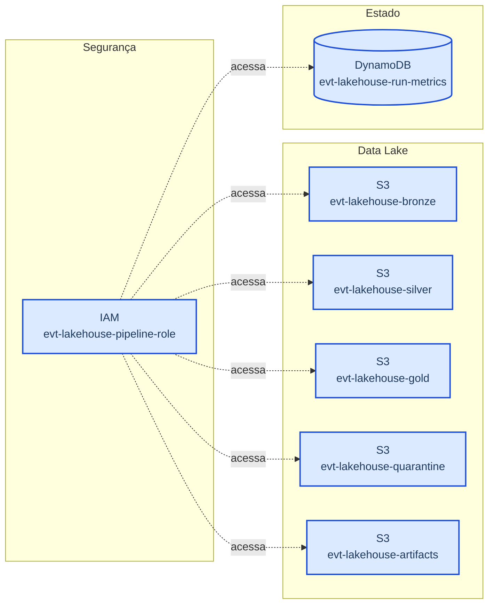
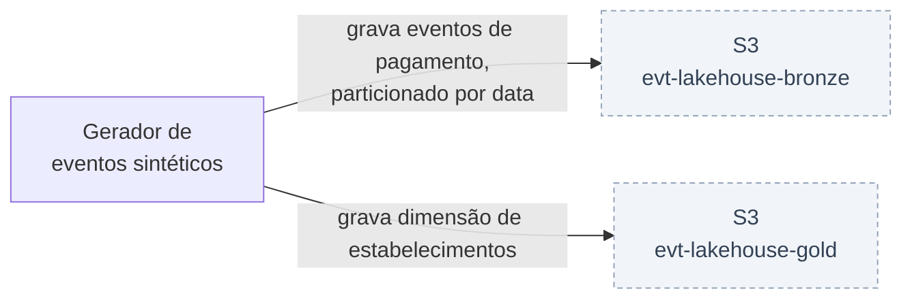
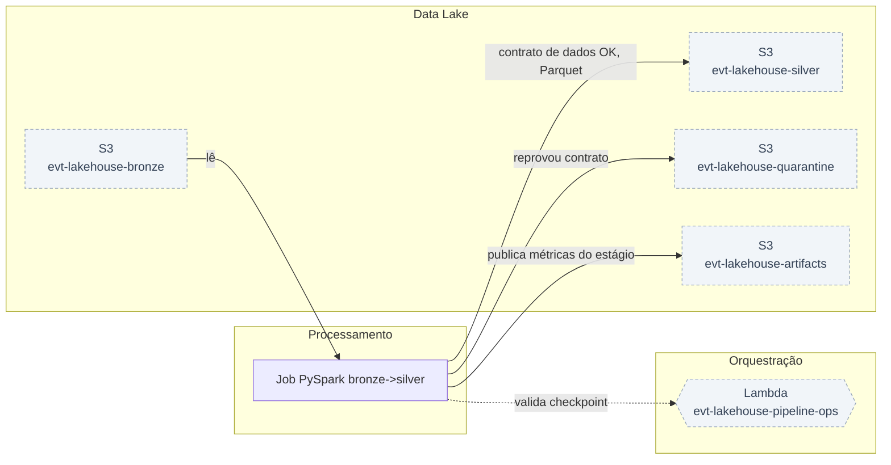
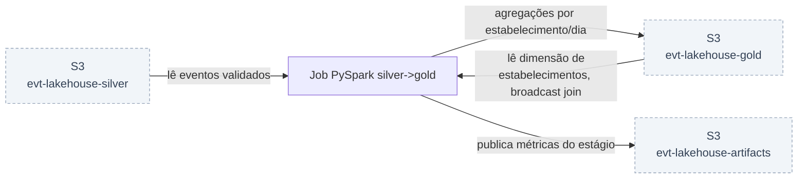
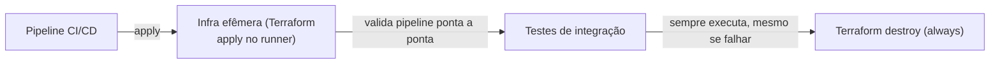

# Arquitetura — Lakehouse de Eventos de Pagamento com Contrato de Dados, Step Functions e CI/CD

Pipeline de eventos de pagamento em arquitetura medallion com quarentena: ingestão na bronze, contrato de dados na passagem pra silver, agregação analítica na gold — processamento em PySpark, orquestração serverless por máquina de estados e infraestrutura 100% declarada em Terraform, executável ponta a ponta em ambiente local.

## Princípios

O pipeline é tratado como um produto de software, não como um conjunto de scripts. Isso significa três separações explícitas:

- **Plano de controle × plano de dados** — quem orquestra (Step Functions) não é quem processa (Spark). O orquestrador valida pré-condições, mede resultados, decide se aprova ou reprova e notifica; o motor de processamento só transforma dados.
- **Lógica de negócio × infraestrutura de execução** — as transformações são funções puras que recebem e devolvem DataFrame, testáveis com pytest sem subir cluster nenhum.
- **Definição × criação de recursos** — tudo que existe na nuvem é declarado em Terraform, versionado no Git e aplicado por pipeline; nenhum recurso nasce de comando solto no terminal.

## Modelo de camadas

Bronze/silver/gold com uma quarta área de quarentena:

- **Bronze** — dado bruto, imutável, exatamente como chegou, particionado por data de ingestão.
- **Silver** — dado validado contra um contrato explícito: tipagem correta, deduplicação, regras de negócio aplicadas.
- **Quarentena** — o que reprova no contrato não é descartado nem corrigido no escuro: vai pra quarentena com o motivo da rejeição gravado.
- **Gold** — dado modelado pra consumo analítico, agregado e enriquecido, pronto pra Athena, Redshift Spectrum ou carga no Redshift.

## Visão geral

## Por componente

### Provisionamento (parte 1): fundação do lakehouse — storage, IAM e tabela de métricas

### Provisionamento (parte 2): plano de controle — Lambda, SNS/SQS e a máquina de estados

### Geração e ingestão dos eventos brutos na camada bronze

### Job PySpark bronze para silver: contrato de dados, quarentena e testes unitários

### Job silver para gold: SQL analítico avançado, broadcast join e exposição para Redshift

### Orquestração ponta a ponta: executar, quebrar de propósito e comparar com Airflow

### CI/CD, FinOps e fechamento: transformar o projeto em software entregável

---

O porquê de cada decisão estrutural está em [`DECISOES.md`](DECISOES.md); os limites assumidos e o caminho de evolução, em [`LIMITACOES.md`](LIMITACOES.md).

