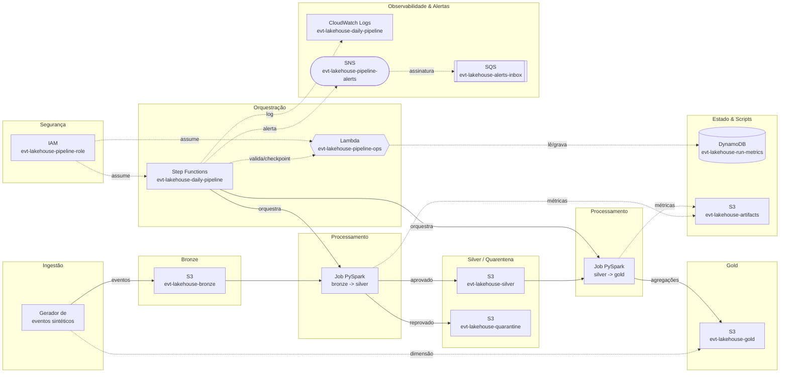
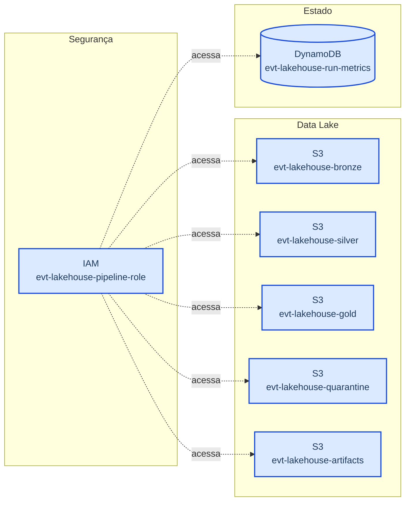
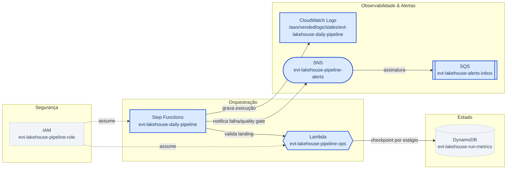
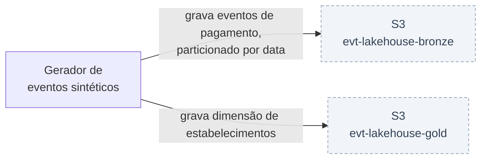
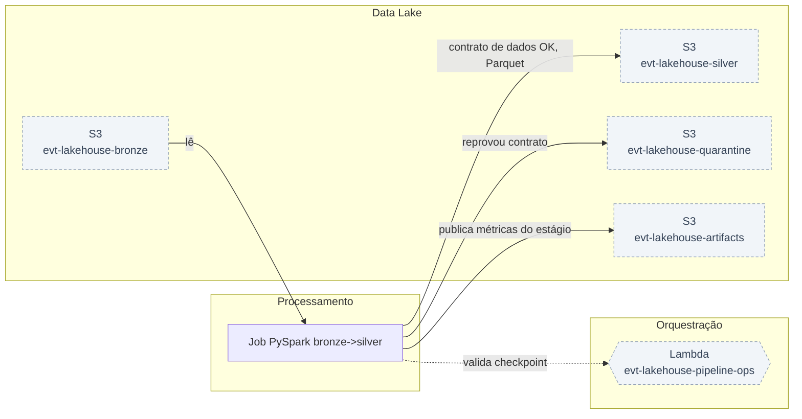
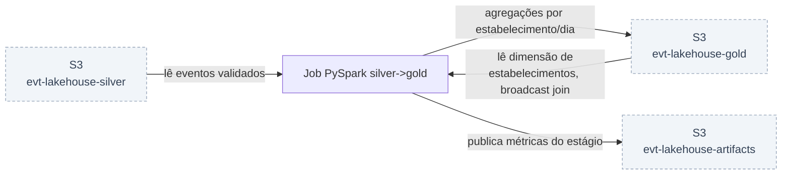
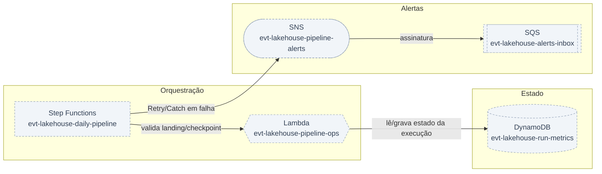
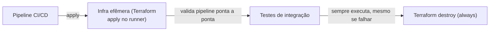

# Arquitetura — Lakehouse de Eventos de Pagamento com Contrato de Dados, Step Functions e CI/CD

Este projeto nasceu dos requisitos de uma vaga real de Engenheiro de Dados Sênior. Peguei a descrição, parafraseei o que era pedido e transformei em um sistema que roda de ponta a ponta na minha máquina: arquitetura em camadas (medallion), processamento distribuído em PySpark, orquestração serverless com máquina de estados, contrato de dados com quarentena, testes automatizados e pipeline de CI. Nada de tutorial genérico — o escopo veio do que o mercado está pedindo.

A ideia central é tratar o pipeline como um produto de software, não como um conjunto de scripts. Isso significa três separações explícitas. Primeiro, separação entre plano de controle e plano de dados: quem orquestra (Step Functions) não é quem processa (Spark). O orquestrador valida pré-condições, mede resultados, decide se aprova ou reprova e notifica; o motor de processamento só transforma dados. Segundo, separação entre lógica de negócio e infraestrutura de execução: as transformações são funções puras que recebem e devolvem DataFrame, então podem ser testadas com pytest sem subir cluster nenhum. Terceiro, separação entre definição e criação de recursos: tudo que existe na nuvem é declarado em Terraform, versionado no Git, aplicado por pipeline — nenhum recurso nasce de comando solto no terminal.

O modelo de camadas usado aqui é bronze/silver/gold com uma quarta área de quarentena. Bronze é o dado bruto, imutável, exatamente como chegou, particionado por data de ingestão. Silver é o dado validado contra um contrato explícito: tipagem correta, deduplicação, regras de negócio aplicadas. O que reprova não é descartado nem corrigido no escuro — vai para a quarentena com o motivo da rejeição gravado, porque dado descartado silenciosamente é o jeito mais rápido de perder confiança no lakehouse. Gold é o dado modelado para consumo analítico, agregado e enriquecido, pronto para ser lido por Athena, Redshift Spectrum ou carregado para dentro do Redshift.

Uma decisão de arquitetura importante e consciente: os jobs são PySpark puro, sem GlueContext e sem DynamicFrame. O custo disso é abrir mão de alguns recursos específicos do Glue (bookmarks nativos, resolveChoice). O ganho é portabilidade total — o mesmo arquivo roda em Glue, em EMR, em EMR Serverless, em Databricks e no container local, sem reescrita. Em ambiente com múltiplos motores de execução e pressão de FinOps, poder mover uma carga de Glue para EMR Serverless (ou vice-versa) só mudando o submit é uma alavanca de custo real, não teórica.

Para orquestração, a escolha é Step Functions em vez de Airflow — e vale entender o trade-off, porque não é consenso. Step Functions é serverless, tem retry/backoff/catch declarativos, integração nativa com serviços AWS, custo por transição de estado e zero infraestrutura para manter. Airflow tem ecossistema de operadores muito maior, backfill nativo, UI superior para diagnóstico e expressividade Python real. A regra prática que uso: pipeline majoritariamente AWS-nativo que precisa de resiliência com baixo custo operacional pede Step Functions; pipeline com muitas integrações heterogêneas, dependências complexas entre DAGs e necessidade constante de backfill pede Airflow. O projeto entrega a implementação em Step Functions e, ao final, a DAG equivalente em Airflow, para deixar a comparação concreta em vez de retórica.

Tudo roda em LocalStack. Isso não é atalho — é uma prática de DataOps: ambiente descartável, idêntico ao de produção na forma dos recursos, com custo zero e ciclo de feedback de segundos. O mesmo Terraform que aponta para o LocalStack aponta para a AWS real trocando o bloco de endpoints, e o mesmo pipeline de CI que valida aqui valida lá. Onde a emulação tem limite, o limite é codificado em variável e documentado, nunca improvisado.

## Visão geral

## Por componente

### Provisionamento (parte 1): fundação do lakehouse — storage, IAM e tabela de métricas

### Provisionamento (parte 2): plano de controle — Lambda, SNS/SQS e a máquina de estados

### Geração e ingestão dos eventos brutos na camada bronze

### Job PySpark bronze para silver: contrato de dados, quarentena e testes unitários

### Job silver para gold: SQL analítico avançado, broadcast join e exposição para Redshift

### Orquestração ponta a ponta: executar, quebrar de propósito e comparar com Airflow

### CI/CD, FinOps e fechamento: transformar o projeto em software entregável

