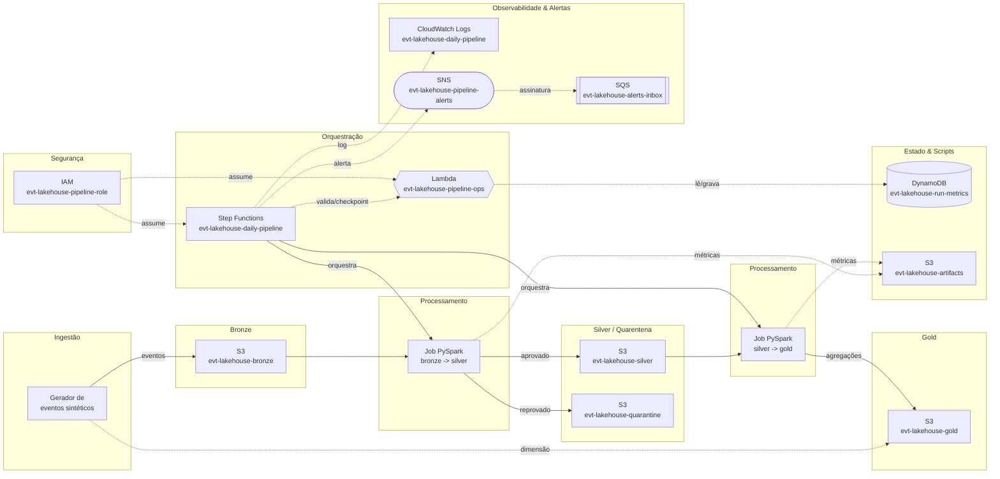
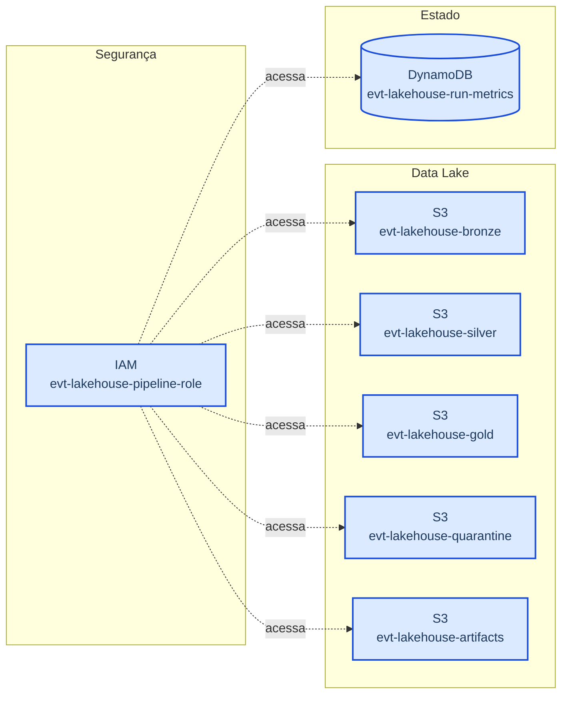
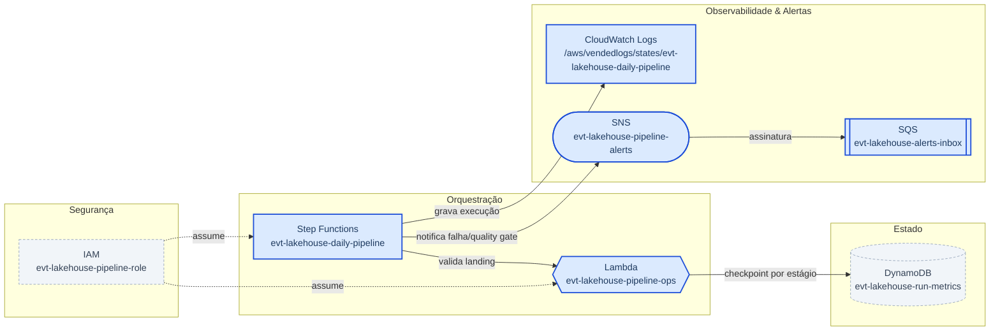
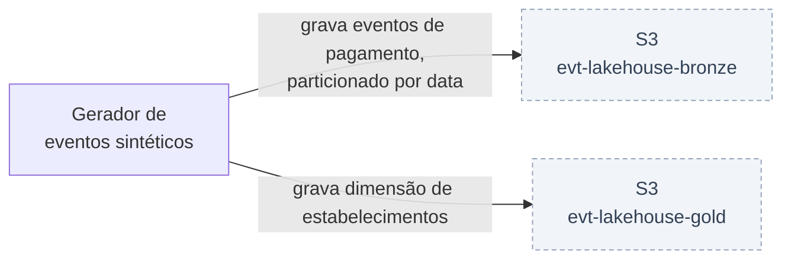
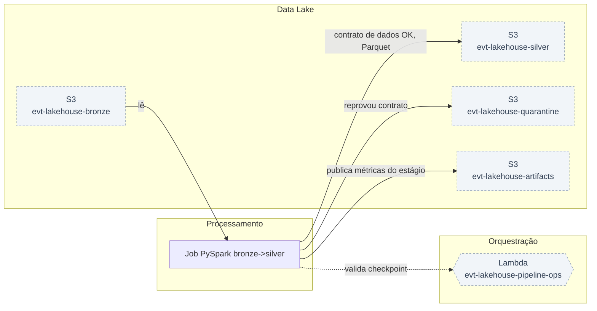
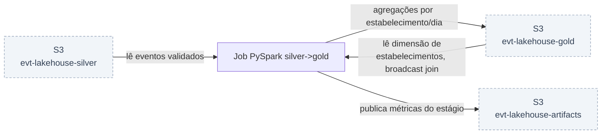
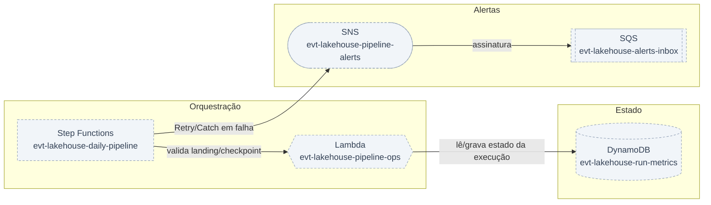
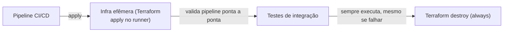

> **Nota:** este é o roteiro completo de construção do projeto, passo a passo, com teoria e código comentado.
> Os arquivos finais estão versionados na raiz do repositório — o roteiro mostra como e por que cada um foi construído.

# Lakehouse de Eventos de Pagamento com Contrato de Dados, Step Functions e CI/CD

> Projeto prático construído a partir dos requisitos de uma vaga real de **Engenheiro de Dados Sr.**.

**⏱️ Tempo total estimado (versão Docker/local):** Aproximadamente 17 horas e 55 minutos de trabalho efetivo, distribuídas assim:

• Passo 1 (fundação do lakehouse em Terraform): 2h05
• Passo 2 (plano de controle e máquina de estados): 2h45
• Passo 3 (geração e ingestão na camada bronze): 1h15
• Passo 4 (contrato de dados, quarentena e testes unitários): 3h10
• Passo 5 (camada gold, SQL analítico e exposição para Redshift): 2h50
• Passo 6 (orquestração ponta a ponta e comparação com Airflow): 2h40
• Passo 7 (CI/CD, FinOps, revisão e fechamento): 3h10

Distribuição realista: de 6 a 8 sessões de 2 a 3 horas, ao longo de duas a três semanas. Vale respeitar essa fragmentação em vez de tentar concentrar em um fim de semana — os passos 4 e 5 exigem depuração de Spark contra S3, que consome tempo de forma imprevisível na primeira vez, e o passo 6 tem esperas reais de até 90 segundos para observar o ciclo completo de retry com backoff.

Do total, cerca de 5 horas e 30 minutos são de estudo dirigido, 8 horas e 40 minutos de implementação e depuração, e 3 horas e 45 minutos de reflexão e documentação. Essa última fatia é a que costuma ser cortada primeiro e a que mais rende: é ela que transforma um repositório funcional em um projeto que você consegue explicar, defender e evoluir.

## Teoria

Este projeto nasceu dos requisitos de uma vaga real de Engenheiro de Dados Sênior. Peguei a descrição, parafraseei o que era pedido e transformei em um sistema que roda de ponta a ponta na minha máquina: arquitetura em camadas (medallion), processamento distribuído em PySpark, orquestração serverless com máquina de estados, contrato de dados com quarentena, testes automatizados e pipeline de CI. Nada de tutorial genérico — o escopo veio do que o mercado está pedindo.

A ideia central é tratar o pipeline como um produto de software, não como um conjunto de scripts. Isso significa três separações explícitas. Primeiro, separação entre plano de controle e plano de dados: quem orquestra (Step Functions) não é quem processa (Spark). O orquestrador valida pré-condições, mede resultados, decide se aprova ou reprova e notifica; o motor de processamento só transforma dados. Segundo, separação entre lógica de negócio e infraestrutura de execução: as transformações são funções puras que recebem e devolvem DataFrame, então podem ser testadas com pytest sem subir cluster nenhum. Terceiro, separação entre definição e criação de recursos: tudo que existe na nuvem é declarado em Terraform, versionado no Git, aplicado por pipeline — nenhum recurso nasce de comando solto no terminal.

O modelo de camadas usado aqui é bronze/silver/gold com uma quarta área de quarentena. Bronze é o dado bruto, imutável, exatamente como chegou, particionado por data de ingestão. Silver é o dado validado contra um contrato explícito: tipagem correta, deduplicação, regras de negócio aplicadas. O que reprova não é descartado nem corrigido no escuro — vai para a quarentena com o motivo da rejeição gravado, porque dado descartado silenciosamente é o jeito mais rápido de perder confiança no lakehouse. Gold é o dado modelado para consumo analítico, agregado e enriquecido, pronto para ser lido por Athena, Redshift Spectrum ou carregado para dentro do Redshift.

Uma decisão de arquitetura importante e consciente: os jobs são PySpark puro, sem GlueContext e sem DynamicFrame. O custo disso é abrir mão de alguns recursos específicos do Glue (bookmarks nativos, resolveChoice). O ganho é portabilidade total — o mesmo arquivo roda em Glue, em EMR, em EMR Serverless, em Databricks e no container local, sem reescrita. Em ambiente com múltiplos motores de execução e pressão de FinOps, poder mover uma carga de Glue para EMR Serverless (ou vice-versa) só mudando o submit é uma alavanca de custo real, não teórica.

Para orquestração, a escolha é Step Functions em vez de Airflow — e vale entender o trade-off, porque não é consenso. Step Functions é serverless, tem retry/backoff/catch declarativos, integração nativa com serviços AWS, custo por transição de estado e zero infraestrutura para manter. Airflow tem ecossistema de operadores muito maior, backfill nativo, UI superior para diagnóstico e expressividade Python real. A regra prática que uso: pipeline majoritariamente AWS-nativo que precisa de resiliência com baixo custo operacional pede Step Functions; pipeline com muitas integrações heterogêneas, dependências complexas entre DAGs e necessidade constante de backfill pede Airflow. O projeto entrega a implementação em Step Functions e, ao final, a DAG equivalente em Airflow, para deixar a comparação concreta em vez de retórica.

Tudo roda em LocalStack. Isso não é atalho — é uma prática de DataOps: ambiente descartável, idêntico ao de produção na forma dos recursos, com custo zero e ciclo de feedback de segundos. O mesmo Terraform que aponta para o LocalStack aponta para a AWS real trocando o bloco de endpoints, e o mesmo pipeline de CI que valida aqui valida lá. Onde a emulação tem limite, o limite é codificado em variável e documentado, nunca improvisado.

## Arquitetura



## Passo a passo — versão Docker / local (sem custo)

### 1. Provisionamento (parte 1): fundação do lakehouse — storage, IAM e tabela de métricas

⏱️ *Estudo (bloco endpoints do provider AWS, for_each versus count, classes de armazenamento do S3, por que versionamento seletivo): 40 minutos.

Implementação (subir o LocalStack, escrever os quatro arquivos, rodar init/validate/apply e diagnosticar o comportamento do ciclo de vida no emulador): 1 hora.

Reflexão (escrever no README por que bucket por camada em vez de prefixo, por que versionamento seletivo, e registrar a limitação do emulador com o diagnóstico que a comprova): 25 minutos.

Total do passo: aproximadamente 2 horas e 5 minutos.*

Este passo cria toda a camada de fundação do projeto com Terraform apontado para o LocalStack. É a base sobre a qual todo o resto se apoia: sem os buckets, sem a role e sem a tabela de métricas, nenhum passo seguinte funciona.

Os recursos criados aqui são:
• cinco buckets S3 (bronze, silver, gold, quarentena e artifacts)
• versionamento habilitado em bronze e quarentena
• regras de ciclo de vida em bronze e quarentena, controladas por flag
• uma tabela DynamoDB para métricas de execução do pipeline
• uma IAM role compartilhada pelo pipeline, com policy própria
• três bancos do Glue Data Catalog, controlados por flag

Por que separar bronze, silver, gold e quarentena em buckets distintos e não em prefixos do mesmo bucket? Porque bucket é a fronteira natural de política no S3: policy de acesso, criptografia, replicação, ciclo de vida e métricas de custo são todas por bucket. Com buckets separados eu consigo dar leitura de gold para o time de analytics sem expor o bronze, aplicar transição para classe de armazenamento mais barata só no bronze (que é volumoso e raramente relido) e ver no Cost Explorer quanto cada camada custa sem precisar de tagging heroico. O custo dessa escolha é mais recursos para gerenciar; o ganho é governança e FinOps que funcionam de verdade.

O versionamento fica ligado só no bronze e na quarentena. Bronze é a fonte da verdade — se eu perder ou sobrescrever, não tem de onde reprocessar. Silver e gold são derivados e reconstrutíveis a partir do bronze, então versionar ali é pagar armazenamento duplicado por algo que o pipeline regenera em minutos. Essa é exatamente a conversa de FinOps que a vaga pede: cada byte guardado precisa justificar por que existe.

A IAM role é única e assumível por Lambda, Step Functions e Glue. Em produção eu separaria em três roles com permissão mínima por serviço — deixo isso explícito porque é o tipo de simplificação que precisa ser declarada, não escondida. Aqui a role única reduz ruído e mantém o foco no fluxo de dados, mas a policy já é escrita com ARNs específicos em vez de curinga, para que a migração para least privilege seja mecânica.

Duas flags existem porque a emulação tem limites conhecidos, e codificar isso em variável é a diferença entre infraestrutura versionada e infraestrutura improvisada. A flag enable_glue fica desligada porque a emulação de Glue e Athena depende da versão Pro do LocalStack. A flag enable_lifecycle fica desligada por um motivo mais sutil e que vale documentar: o LocalStack community grava a regra de ciclo de vida corretamente, mas não devolve na leitura todos os campos que o provider AWS 5.x usa para decidir que o recurso convergiu, então o apply fica esperando estabilização e estoura em três minutos. A regra existe no emulador, mas nunca entra no state. Na AWS real basta ligar a flag.



```hcl
# ==========================================================================
# ESTRUTURA DE DIRETORIOS DO PROJETO (crie antes de comecar)
# ==========================================================================
# evt-lakehouse/
#   docker-compose.yml
#   infra/            -> Terraform (providers.tf, variables.tf, main.tf, orchestration.tf)
#   lambda/           -> codigo do plano de controle
#   ingest/           -> gerador e ingestao de eventos
#   jobs/             -> jobs PySpark
#   tests/            -> testes unitarios
#   sql/              -> consultas de validacao / DDL Redshift
#   airflow/          -> DAG equivalente
#   .github/workflows -> CI

mkdir -p evt-lakehouse/{infra,lambda,ingest,jobs,tests,sql,airflow,.github/workflows}
cd evt-lakehouse


# ==========================================================================
# arquivo: docker-compose.yml
# Sobe o LocalStack numa rede Docker dedicada. A rede nomeada e essencial:
# os containers Spark vao resolver o LocalStack pelo hostname "localstack",
# enquanto o Terraform (rodando no host) o acessa por localhost:4566.
# ==========================================================================
cat > docker-compose.yml <<'YAML'
services:
  localstack:
    image: localstack/localstack:3.8
    container_name: localstack
    ports:
      - "4566:4566"
    environment:
      - SERVICES=s3,iam,sts,dynamodb,lambda,stepfunctions,sns,sqs,logs
      - DEBUG=0
      - LAMBDA_DOCKER_NETWORK=lakehouse-net
      - DOCKER_HOST=unix:///var/run/docker.sock
    volumes:
      - "/var/run/docker.sock:/var/run/docker.sock"
      - "./.localstack:/var/lib/localstack"
    networks:
      - lakehouse-net

networks:
  lakehouse-net:
    name: lakehouse-net
YAML

# Sobe o ambiente em background e aguarda o health check ficar pronto.
docker compose up -d
until curl -s http://localhost:4566/_localstack/health | grep -q '"s3"'; do sleep 2; done


# ==========================================================================
# arquivo: infra/providers.tf
# Provider AWS redirecionado para o LocalStack. As tres flags de skip evitam
# que o provider tente validar credencial e descobrir account id em servicos
# que o emulador nao implementa igual. s3_use_path_style e obrigatorio porque
# o LocalStack nao resolve bucket como subdominio.
# ==========================================================================
cat > infra/providers.tf <<'HCL'
terraform {
  required_version = ">= 1.6.0"
  required_providers {
    # aws travado abaixo de 5.67: a partir dela o provider valida a definicao de
    # Step Functions via ValidateStateMachineDefinition, API que o LocalStack
    # community nao implementa -- o apply quebra com 501 mesmo com a definicao certa.
    aws     = { source = "hashicorp/aws", version = ">= 5.60.0, < 5.67.0" }
    archive = { source = "hashicorp/archive", version = "~> 2.4" }
  }
}

provider "aws" {
  region                      = "us-east-1"
  access_key                  = "test"
  secret_key                  = "test"
  skip_credentials_validation = true
  skip_requesting_account_id  = true
  skip_metadata_api_check     = true
  s3_use_path_style           = true

  endpoints {
    s3             = "http://localhost:4566"
    iam            = "http://localhost:4566"
    sts            = "http://localhost:4566"
    dynamodb       = "http://localhost:4566"
    lambda         = "http://localhost:4566"
    stepfunctions  = "http://localhost:4566"
    sns            = "http://localhost:4566"
    sqs            = "http://localhost:4566"
    cloudwatchlogs = "http://localhost:4566"
    glue           = "http://localhost:4566"
  }
}
HCL


# ==========================================================================
# arquivo: infra/variables.tf
# Prefixo do projeto e as duas flags que isolam o que o emulador community
# nao suporta. Toda opcionalidade fica em variavel, nunca em bloco comentado.
# ==========================================================================
cat > infra/variables.tf <<'HCL'
variable "project" {
  description = "Prefixo usado em todos os nomes de recurso"
  type        = string
  default     = "evt-lakehouse"
}

variable "enable_glue" {
  description = "Cria Glue Catalog/Crawler/Jobs (requer LocalStack Pro)"
  type        = bool
  default     = false
}

variable "enable_lifecycle" {
  description = "Cria regras de ciclo de vida no S3. O LocalStack community grava a regra mas nao devolve na leitura os campos que o provider usa para confirmar convergencia, entao o apply estoura por timeout. Desligado localmente, ligado na AWS real."
  type        = bool
  default     = false
}

variable "max_reject_rate" {
  description = "Taxa maxima de rejeicao aceita pelo quality gate"
  type        = number
  default     = 0.05
}
HCL


# ==========================================================================
# arquivo: infra/main.tf  (fundacao)
# ==========================================================================
cat > infra/main.tf <<'HCL'
# Mapa das camadas do lakehouse. Centralizar aqui evita nome divergente
# entre recursos e mantem coerencia com o codigo Python/Spark.
locals {
  layers      = ["bronze", "silver", "gold", "quarantine", "artifacts"]
  versioned   = ["bronze", "quarantine"]
  glue_dbs    = ["bronze", "silver", "gold"]
  bucket_arns = [for l in local.layers : "arn:aws:s3:::${var.project}-${l}"]
}

# Um bucket por camada do lakehouse. Bucket e a fronteira natural de policy,
# ciclo de vida e apuracao de custo no S3 - por isso nao usamos prefixos.
resource "aws_s3_bucket" "layer" {
  for_each      = toset(local.layers)
  bucket        = "${var.project}-${each.value}"
  force_destroy = true

  tags = {
    Project = var.project
    Layer   = each.value
  }
}

# Versionamento apenas nas camadas nao reconstrutiveis (bronze e quarentena).
# Silver e gold sao derivados: versionar seria pagar storage por algo
# que o pipeline regenera em minutos.
resource "aws_s3_bucket_versioning" "layer" {
  for_each = toset(local.versioned)
  bucket   = aws_s3_bucket.layer[each.value].id
  versioning_configuration {
    status = "Enabled"
  }
}

# Ciclo de vida = FinOps aplicado. Bronze e volumoso e raramente relido,
# entao migra para classes mais baratas; versoes antigas expiram para nao
# acumular custo invisivel. Sob flag: o emulador community nao converge.
resource "aws_s3_bucket_lifecycle_configuration" "bronze" {
  count  = var.enable_lifecycle ? 1 : 0
  bucket = aws_s3_bucket.layer["bronze"].id

  rule {
    id     = "bronze-tiering"
    status = "Enabled"

    filter {
      prefix = ""
    }

    transition {
      days          = 30
      storage_class = "STANDARD_IA"
    }
    transition {
      days          = 120
      storage_class = "GLACIER_IR"
    }
    noncurrent_version_expiration {
      noncurrent_days = 30
    }
    abort_incomplete_multipart_upload {
      days_after_initiation = 7
    }
  }
}

# Quarentena tem retencao curta e definida: dado rejeitado serve para
# diagnostico, nao para arquivo eterno. Mesma flag do bronze.
resource "aws_s3_bucket_lifecycle_configuration" "quarantine" {
  count  = var.enable_lifecycle ? 1 : 0
  bucket = aws_s3_bucket.layer["quarantine"].id

  rule {
    id     = "quarantine-retention"
    status = "Enabled"

    filter {
      prefix = ""
    }

    expiration {
      days = 90
    }
  }
}

# Tabela de metricas por execucao. Chave composta (run_id, stage) permite
# ler todos os estagios de uma execucao com um unico Query - e isso que o
# quality gate faz antes de aprovar ou reprovar o pipeline.
resource "aws_dynamodb_table" "run_metrics" {
  name         = "${var.project}-run-metrics"
  billing_mode = "PAY_PER_REQUEST"
  hash_key     = "run_id"
  range_key    = "stage"

  attribute {
    name = "run_id"
    type = "S"
  }
  attribute {
    name = "stage"
    type = "S"
  }

  tags = { Project = var.project }
}

# Role unica assumida por Lambda, Step Functions e Glue. Em producao seriam
# tres roles com permissao minima; a simplificacao esta declarada de
# proposito e a policy ja usa ARN especifico para facilitar a separacao.
resource "aws_iam_role" "pipeline" {
  name = "${var.project}-pipeline-role"

  assume_role_policy = jsonencode({
    Version = "2012-10-17"
    Statement = [{
      Effect = "Allow"
      Action = "sts:AssumeRole"
      Principal = {
        Service = [
          "lambda.amazonaws.com",
          "states.amazonaws.com",
          "glue.amazonaws.com"
        ]
      }
    }]
  })
}

# Permissoes do pipeline com ARN explicito por recurso. Curinga so onde o
# servico exige (logs e criacao de log stream dinamica).
resource "aws_iam_policy" "pipeline" {
  name = "${var.project}-pipeline-policy"

  policy = jsonencode({
    Version = "2012-10-17"
    Statement = [
      {
        Effect   = "Allow"
        Action   = ["s3:ListBucket", "s3:GetBucketLocation"]
        Resource = local.bucket_arns
      },
      {
        Effect   = "Allow"
        Action   = ["s3:GetObject", "s3:PutObject", "s3:DeleteObject"]
        Resource = [for a in local.bucket_arns : "${a}/*"]
      },
      {
        Effect   = "Allow"
        Action   = ["dynamodb:PutItem", "dynamodb:Query", "dynamodb:GetItem"]
        Resource = aws_dynamodb_table.run_metrics.arn
      },
      {
        Effect   = "Allow"
        Action   = ["logs:CreateLogGroup", "logs:CreateLogStream", "logs:PutLogEvents"]
        Resource = "*"
      }
    ]
  })
}

# Vincula a policy a role. Recurso separado do role e da policy: e assim que
# o Terraform mantem o grafo de dependencia explicito e o destroy limpo.
resource "aws_iam_role_policy_attachment" "pipeline" {
  role       = aws_iam_role.pipeline.name
  policy_arn = aws_iam_policy.pipeline.arn
}

# Bancos do Glue Data Catalog, um por camada. Criados apenas quando
# enable_glue = true, porque a emulacao de Glue exige LocalStack Pro.
resource "aws_glue_catalog_database" "layer" {
  for_each    = var.enable_glue ? toset(local.glue_dbs) : toset([])
  name        = replace("${var.project}_${each.value}", "-", "_")
  description = "Camada ${each.value} do lakehouse de eventos de pagamento"
}

# Saidas usadas pelos passos seguintes (scripts e comandos CLI).
output "buckets" {
  value = { for l, b in aws_s3_bucket.layer : l => b.id }
}

output "pipeline_role_arn" {
  value = aws_iam_role.pipeline.arn
}

output "metrics_table" {
  value = aws_dynamodb_table.run_metrics.name
}
HCL


# ==========================================================================
# Aplicacao da infraestrutura.
# init baixa os providers; validate pega erro de sintaxe/tipo antes do apply.
# ==========================================================================
terraform -chdir=infra init
terraform -chdir=infra validate
terraform -chdir=infra apply -auto-approve
```

**Como verificar:** Confirme que os cinco buckets existem e que os nomes batem com o esperado:

aws --endpoint-url=http://localhost:4566 s3 ls

A saída deve listar evt-lakehouse-bronze, evt-lakehouse-silver, evt-lakehouse-gold, evt-lakehouse-quarantine e evt-lakehouse-artifacts.

Confirme o versionamento seletivo (bronze deve retornar Enabled, silver deve retornar vazio):

aws --endpoint-url=http://localhost:4566 s3api get-bucket-versioning --bucket evt-lakehouse-bronze
aws --endpoint-url=http://localhost:4566 s3api get-bucket-versioning --bucket evt-lakehouse-silver

Confirme a tabela DynamoDB e a role:

aws --endpoint-url=http://localhost:4566 dynamodb describe-table --table-name evt-lakehouse-run-metrics --query 'Table.KeySchema'
aws --endpoint-url=http://localhost:4566 iam get-role --role-name evt-lakehouse-pipeline-role --query 'Role.Arn'

Confirme o state e os outputs:

terraform -chdir=infra state list
terraform -chdir=infra output

O state deve listar 11 recursos com as flags desligadas — cinco buckets, dois versionamentos, a tabela, a role, a policy e o attachment. Anote esse número: na AWS real, com enable_lifecycle e enable_glue ligados, ele sobe para 16. Saber explicar a diferença vale mais do que fingir que ela não existe.

Se quiser ver o comportamento do ciclo de vida por curiosidade, rode terraform -chdir=infra apply -var="enable_lifecycle=true" e observe o apply estourar por timeout após três minutos. Depois confirme que a regra existe apesar do erro:

aws --endpoint-url=http://localhost:4566 s3api get-bucket-lifecycle-configuration --bucket evt-lakehouse-bronze

Esse é o diagnóstico completo: o PUT funciona, a leitura de confirmação é que não. Volte a flag para false e siga.

Para limpar tudo ao final, rode terraform -chdir=infra destroy (o force_destroy nos buckets garante que funcione mesmo com objetos dentro) e depois docker compose down -v para derrubar o LocalStack.

> ☁️ **AWS:** Autenticação: credenciais fake ("test"/"test") com validação desabilitada no provider. Nenhuma credencial real é usada em nenhum momento do projeto.

Recursos criados:
• 5 buckets S3 (evt-lakehouse-bronze, -silver, -gold, -quarantine, -artifacts)
• 2 configurações de versionamento (bronze e quarantine)
• 1 tabela DynamoDB (evt-lakehouse-run-metrics)
• 1 IAM role (evt-lakehouse-pipeline-role) + 1 policy + 1 attachment
• 2 ciclos de vida e 3 Glue Catalog Databases, somente com as flags ligadas

Passo a passo: subir o LocalStack via docker compose, aguardar o health check, rodar terraform init, terraform validate e terraform apply.

Custo: zero. Tudo é emulado localmente. Na AWS real, os recursos deste passo custariam praticamente nada por si só — buckets vazios e IAM não têm custo, e o DynamoDB em PAY_PER_REQUEST só cobra por operação. O custo apareceria no volume de dados armazenado, que é justamente o que as regras de ciclo de vida atacam.

> 🧾 **Recursos criados:** aws_s3_bucket.layer["bronze"] -> evt-lakehouse-bronze
Camada de ingestão bruta: recebe os eventos de pagamento exatamente como chegam (JSON), particionados por data. É o ponto de entrada de todo o pipeline -- nada é transformado aqui ainda.

aws_s3_bucket.layer["silver"] -> evt-lakehouse-silver
Camada validada: recebe só o que passou pelo contrato de dados (schema + testes), já em Parquet. É o que o job silver->gold lê depois.

aws_s3_bucket.layer["gold"] -> evt-lakehouse-gold
Camada de consumo: métricas agregadas por estabelecimento e dia (faturamento, ticket médio, taxa de aprovação), prontas pra virar dashboard ou alimentar o Redshift.

aws_s3_bucket.layer["quarantine"] -> evt-lakehouse-quarantine
Isola os registros que reprovaram o contrato de dados, com o motivo anotado -- nunca descarta o dado ruim, só separa ele pra auditoria e pro cálculo da taxa de rejeição.

aws_s3_bucket.layer["artifacts"] -> evt-lakehouse-artifacts
Bucket auxiliar: guarda os arquivos de métricas que cada estágio do pipeline publica pro plano de controle ler -- é artefato/estado de execução, não dado de negócio (a dimensão de estabelecimentos usada no join da camada gold fica no próprio bucket gold, não aqui).

aws_s3_bucket_versioning.layer["bronze"]
Versionamento ligado no bronze pra nunca perder o dado bruto original, mesmo que um reprocessamento sobrescreva a mesma partição.

aws_s3_bucket_versioning.layer["quarantine"]
Mesma proteção na quarentena -- histórico de rejeições preservado, útil pra investigar padrões de dado ruim ao longo do tempo.

aws_dynamodb_table.run_metrics -> evt-lakehouse-run-metrics
Tabela de estado do pipeline: registra o checkpoint de cada estágio (bronze/silver/gold) por execução (run_id). É o que a Lambda consulta e grava, e o que o Step Functions usa pra decidir se pode avançar.

aws_iam_role.pipeline -> evt-lakehouse-pipeline-role
Identidade única assumida pela Lambda, pelo Step Functions e (na versão real) pelo Glue -- concentra o acesso a S3/DynamoDB/logs num só lugar, em vez de uma role por serviço.

aws_iam_policy.pipeline -> evt-lakehouse-pipeline-policy
As permissões de fato (ListBucket/Get/Put/Delete em S3, PutItem/Query/GetItem em DynamoDB, CreateLogGroup/PutLogEvents) que ficam presas à role acima.

aws_iam_role_policy_attachment.pipeline
O vínculo entre a role e a policy -- sem ele a role existe mas não tem permissão nenhuma; é um recurso Terraform separado por design (mantém o grafo de dependência explícito e o destroy limpo).

Com enable_lifecycle=true soma +2 (aws_s3_bucket_lifecycle_configuration.bronze/quarantine); com enable_glue=true soma +3 (aws_glue_catalog_database.layer x3) -- nenhuma das duas ligada por padrão.

Total acumulado do projeto: 11 recursos.

> ⏸️ **Pausar e retomar depois:** Se for parar por hoje logo depois deste passo, pode deixar o container do LocalStack rodando -- amanhã o terraform plan deve dar 'No changes' e você já emenda no Passo 2. Se for desligar a máquina, sem problema: como o docker-compose.yml não tem PERSISTENCE=1, os 11 recursos somem quando o container para de qualquer forma -- é só subir o LocalStack de novo e rodar terraform apply (poucos segundos, sem custo) antes de seguir.

### 2. Provisionamento (parte 2): plano de controle — Lambda, SNS/SQS e a máquina de estados

⏱️ *Estudo (Amazon States Language: Task, Map com Iterator, Choice, Retry/Catch, objeto de contexto $$, integrações otimizadas com SNS): 1 hora.

Implementação (escrever a Lambda com as três ações, montar o ASL em jsonencode, aplicar e depurar os erros de path do ASL — que sempre aparecem na primeira tentativa): 1 hora e 20 minutos.

Reflexão (documentar por que Retry específico e não States.ALL, e por que uma Lambda com despacho em vez de três funções): 25 minutos.

Total do passo: aproximadamente 2 horas e 45 minutos.*

Com a fundação pronta, este passo cria o plano de controle do pipeline: o componente que decide, mede e notifica. É aqui que entra o Step Functions, e a decisão de design mais importante do projeto acontece neste ponto.

O orquestrador não processa dado. Ele executa quatro responsabilidades: valida se a pré-condição de entrada existe (a partição do dia chegou no bronze?), acompanha cada estágio e registra as métricas que aquele estágio produziu, aplica um portão de qualidade que compara a taxa de rejeição contra um limite configurado, e notifica o resultado. Se qualquer coisa falhar, ele tenta de novo com backoff exponencial; se continuar falhando, captura o erro, notifica e termina em estado de falha explícito. Isso é resiliência declarativa — não existe try/except espalhado por script.

Os recursos criados aqui são:
• uma função Lambda de plano de controle (evt-lakehouse-pipeline-ops)
• um tópico SNS de alertas + uma fila SQS assinando o tópico
• um log group do CloudWatch para a máquina de estados
• a máquina de estados evt-lakehouse-daily-pipeline

A fila SQS assinando o tópico SNS existe por um motivo prático: notificação por e-mail exige confirmação de assinatura e não dá para verificar localmente. Com a fila, eu leio a mensagem publicada e provo que a notificação saiu. Esse tipo de escolha — tornar o efeito colateral observável no teste — é o que separa um pipeline que "parece funcionar" de um pipeline verificável.

Uma única Lambda faz as três ações (validate_landing, checkpoint_stage, quality_gate), despachando pelo campo action do evento. A alternativa seria três Lambdas separadas. O trade-off: três funções dariam permissão e observabilidade mais granulares, mas triplicariam o custo de manutenção de empacotamento, deploy e versionamento para código que compartilha as mesmas dependências e o mesmo domínio. Para um plano de controle pequeno e coeso, uma função com despacho é a escolha certa; quando as ações começarem a ter perfis de memória ou timeout muito diferentes, aí sim vale separar.

O bloco Retry na ação de checkpoint merece atenção. Ele reagenda especificamente o erro StageOutputMissingError, com intervalo de 10 segundos, três tentativas e backoff exponencial. Isso trata o caso realista de consistência eventual e de job que ainda está terminando de escrever. Retry genérico em States.ALL é anti-padrão: você acaba repetindo erro determinístico (schema errado, bug de código) três vezes, pagando três vezes pelo mesmo fracasso. Retry deve ser específico para erro transitório.

O Map com MaxConcurrency igual a 1 processa os estágios em sequência, porque gold depende de silver. Se os estágios fossem independentes (por exemplo, várias tabelas de domínio distintas), bastaria aumentar a concorrência para paralelizar sem tocar em mais nada — e essa é a elegância do Map: paralelismo vira parâmetro, não reescrita.



```hcl
# ==========================================================================
# arquivo: lambda/pipeline_ops.py
# Plano de controle do pipeline. Nao transforma dado: valida pre-condicao,
# le as metricas que o Spark publicou, grava no DynamoDB e decide o gate.
# ==========================================================================
cat > lambda/pipeline_ops.py <<'PY'
import json
import os
from datetime import datetime, timezone

import boto3

PROJECT = os.environ["PROJECT"]
METRICS_TABLE = os.environ["METRICS_TABLE"]
MAX_REJECT_RATE = float(os.environ.get("MAX_REJECT_RATE", "0.05"))
REGION = os.environ.get("AWS_REGION", "us-east-1")

# Prefixo de saida de cada estagio. Fonte unica de verdade sobre onde cada
# camada escreve - o Spark usa exatamente os mesmos caminhos.
STAGE_OUTPUT = {
    "silver": (f"{PROJECT}-silver", "events"),
    "gold": (f"{PROJECT}-gold", "merchant_daily"),
}


# Erros de dominio com nome proprio: o Step Functions faz Retry/Catch pelo
# nome da classe, entao errar aqui quebra a politica de resiliencia.
class LandingEmptyError(Exception):
    pass


class StageOutputMissingError(Exception):
    pass


# Dentro do LocalStack a Lambda enxerga o emulador pelo hostname injetado
# em LOCALSTACK_HOSTNAME. Na AWS real a variavel nao existe e o boto3
# resolve o endpoint padrao - o mesmo codigo serve para os dois ambientes.
def _client(service):
    host = os.environ.get("LOCALSTACK_HOSTNAME")
    if host:
        return boto3.client(service, endpoint_url=f"http://{host}:4566", region_name=REGION)
    return boto3.client(service, region_name=REGION)


# Conta objetos sob um prefixo usando paginacao. list_objects_v2 devolve no
# maximo 1000 chaves por chamada; sem paginator a contagem fica errada em
# particao grande.
def _count_objects(bucket, prefix):
    s3 = _client("s3")
    total = 0
    for page in s3.get_paginator("list_objects_v2").paginate(Bucket=bucket, Prefix=prefix):
        total += page.get("KeyCount", 0)
    return total


# Le o arquivo de metricas que o job Spark escreveu. O Spark grava um
# diretorio com part-*.json, entao localizamos a primeira chave .json
# em vez de assumir um nome fixo.
def _read_stage_metrics(stage, dt):
    s3 = _client("s3")
    bucket = f"{PROJECT}-artifacts"
    prefix = f"metrics/{stage}/dt={dt}/"
    resp = s3.list_objects_v2(Bucket=bucket, Prefix=prefix)
    for obj in resp.get("Contents", []):
        if obj["Key"].endswith(".json"):
            body = s3.get_object(Bucket=bucket, Key=obj["Key"])["Body"].read().decode("utf-8")
            return json.loads(body.strip().splitlines()[0])
    return {}


# Acao 1: valida se a particao do dia chegou no bronze. E a pre-condicao do
# pipeline inteiro - falhar cedo aqui evita queimar recurso de cluster.
def validate_landing(event):
    dt = event["dt"]
    bucket = f"{PROJECT}-bronze"
    prefix = f"events/dt={dt}/"
    count = _count_objects(bucket, prefix)
    if count == 0:
        raise LandingEmptyError(f"Nenhum arquivo em s3://{bucket}/{prefix}")
    return {"dt": dt, "landing_objects": count}


# Acao 2: confirma que o estagio produziu saida, le as metricas dele e
# persiste no DynamoDB. Se a saida nao existe, lanca erro retentavel.
def checkpoint_stage(event):
    dt, stage, run_id = event["dt"], event["stage"], event["run_id"]
    bucket, root = STAGE_OUTPUT[stage]
    prefix = f"{root}/dt={dt}/"
    count = _count_objects(bucket, prefix)
    if count == 0:
        raise StageOutputMissingError(f"Estagio {stage} sem saida em s3://{bucket}/{prefix}")

    metrics = _read_stage_metrics(stage, dt)
    _client("dynamodb").put_item(
        TableName=METRICS_TABLE,
        Item={
            "run_id": {"S": run_id},
            "stage": {"S": stage},
            "dt": {"S": dt},
            "output_objects": {"N": str(count)},
            "metrics": {"S": json.dumps(metrics)},
            "recorded_at": {"S": datetime.now(timezone.utc).isoformat()},
        },
    )
    return {"stage": stage, "output_objects": count, "metrics": metrics}


# Acao 3: portao de qualidade. Le todas as metricas da execucao e compara a
# taxa de rejeicao do silver contra o limite. Retorna PASS/FAIL e a mensagem
# que sera publicada no SNS.
def quality_gate(event):
    run_id, dt = event["run_id"], event["dt"]
    resp = _client("dynamodb").query(
        TableName=METRICS_TABLE,
        KeyConditionExpression="run_id = :r",
        ExpressionAttributeValues={":r": {"S": run_id}},
    )
    silver = {}
    for item in resp.get("Items", []):
        if item["stage"]["S"] == "silver":
            silver = json.loads(item["metrics"]["S"])

    total = int(silver.get("input_records", 0))
    rejected = int(silver.get("rejected_records", 0))
    rate = (rejected / total) if total else 1.0
    status = "PASS" if rate <= MAX_REJECT_RATE else "FAIL"

    return {
        "status": status,
        "reject_rate": round(rate, 4),
        "threshold": MAX_REJECT_RATE,
        "message": (
            f"[{status}] run={run_id} dt={dt} "
            f"registros={total} rejeitados={rejected} "
            f"taxa={rate:.2%} limite={MAX_REJECT_RATE:.2%}"
        ),
    }


ACTIONS = {
    "validate_landing": validate_landing,
    "checkpoint_stage": checkpoint_stage,
    "quality_gate": quality_gate,
}


# Despacho unico. Acao desconhecida vira erro explicito em vez de retorno
# silencioso vazio, que seria muito pior de diagnosticar.
def handler(event, context):
    action = event.get("action")
    if action not in ACTIONS:
        raise ValueError(f"Acao desconhecida: {action}")
    return ACTIONS[action](event)
PY


# ==========================================================================
# arquivo: infra/orchestration.tf
# ==========================================================================
cat > infra/orchestration.tf <<'HCL'
# Empacota a pasta lambda/ em zip no momento do plan. Sem passo manual de
# build: o artefato e derivado do codigo versionado.
data "archive_file" "pipeline_ops" {
  type        = "zip"
  source_dir  = "${path.module}/../lambda"
  output_path = "${path.module}/.build/pipeline_ops.zip"
}

# Funcao de plano de controle. As variaveis de ambiente carregam os nomes
# reais dos recursos criados no passo 1 - nada e hardcoded no Python.
resource "aws_lambda_function" "pipeline_ops" {
  function_name    = "${var.project}-pipeline-ops"
  role             = aws_iam_role.pipeline.arn
  handler          = "pipeline_ops.handler"
  runtime          = "python3.12"
  filename         = data.archive_file.pipeline_ops.output_path
  source_code_hash = data.archive_file.pipeline_ops.output_base64sha256
  timeout          = 60
  memory_size      = 256

  environment {
    variables = {
      PROJECT         = var.project
      METRICS_TABLE   = aws_dynamodb_table.run_metrics.name
      MAX_REJECT_RATE = tostring(var.max_reject_rate)
    }
  }
}

# Topico de alertas do pipeline (sucesso e falha).
resource "aws_sns_topic" "alerts" {
  name = "${var.project}-pipeline-alerts"
}

# Fila assinando o topico. Existe para tornar a notificacao verificavel
# localmente: assinatura por e-mail exigiria confirmacao manual.
resource "aws_sqs_queue" "alerts_inbox" {
  name = "${var.project}-alerts-inbox"
}

resource "aws_sns_topic_subscription" "alerts_to_sqs" {
  topic_arn            = aws_sns_topic.alerts.arn
  protocol             = "sqs"
  endpoint             = aws_sqs_queue.alerts_inbox.arn
  raw_message_delivery = true
}

# Log group da maquina de estados, com retencao curta (FinOps: log de
# pipeline diario raramente e util depois de duas semanas).
resource "aws_cloudwatch_log_group" "sfn" {
  name              = "/aws/vendedlogs/states/${var.project}-daily-pipeline"
  retention_in_days = 14
}

# Definicao da maquina de estados em ASL. Escrita com jsonencode para que o
# Terraform valide a estrutura e interpole ARNs reais em vez de string solta.
locals {
  state_machine_definition = jsonencode({
    Comment = "Pipeline diario do lakehouse de eventos de pagamento"
    StartAt = "ValidateLanding"
    States = {

      # Pre-condicao: a particao do dia precisa existir no bronze.
      ValidateLanding = {
        Type     = "Task"
        Resource = aws_lambda_function.pipeline_ops.arn
        Parameters = {
          "action"   = "validate_landing"
          "run_id.$" = "$.run_id"
          "dt.$"     = "$.dt"
        }
        ResultPath = "$.landing"
        Retry = [{
          ErrorEquals     = ["Lambda.ServiceException", "Lambda.TooManyRequestsException"]
          IntervalSeconds = 3
          MaxAttempts     = 2
          BackoffRate     = 2
        }]
        Catch = [{
          ErrorEquals = ["States.ALL"]
          ResultPath  = "$.error"
          Next        = "NotifyFailure"
        }]
        Next = "ProcessStages"
      }

      # Percorre os estagios em ordem (MaxConcurrency 1 porque gold depende
      # de silver). Paralelizar no futuro e so aumentar esse numero.
      ProcessStages = {
        Type           = "Map"
        ItemsPath      = "$.stages"
        MaxConcurrency = 1
        Parameters = {
          "action"   = "checkpoint_stage"
          "run_id.$" = "$.run_id"
          "dt.$"     = "$.dt"
          "stage.$"  = "$$.Map.Item.Value"
        }
        Iterator = {
          StartAt = "CheckpointStage"
          States = {
            CheckpointStage = {
              Type     = "Task"
              Resource = aws_lambda_function.pipeline_ops.arn
              Retry = [{
                ErrorEquals     = ["StageOutputMissingError"]
                IntervalSeconds = 10
                MaxAttempts     = 3
                BackoffRate     = 2
              }]
              End = true
            }
          }
        }
        ResultPath = "$.stage_results"
        Catch = [{
          ErrorEquals = ["States.ALL"]
          ResultPath  = "$.error"
          Next        = "NotifyFailure"
        }]
        Next = "QualityGate"
      }

      # Portao de qualidade: le as metricas gravadas e decide PASS/FAIL.
      QualityGate = {
        Type     = "Task"
        Resource = aws_lambda_function.pipeline_ops.arn
        Parameters = {
          "action"   = "quality_gate"
          "run_id.$" = "$.run_id"
          "dt.$"     = "$.dt"
        }
        ResultPath = "$.gate"
        Catch = [{
          ErrorEquals = ["States.ALL"]
          ResultPath  = "$.error"
          Next        = "NotifyFailure"
        }]
        Next = "EvaluateGate"
      }

      EvaluateGate = {
        Type = "Choice"
        Choices = [{
          Variable     = "$.gate.status"
          StringEquals = "PASS"
          Next         = "NotifySuccess"
        }]
        Default = "NotifyFailure"
      }

      # Notificacao de sucesso usando a integracao otimizada com SNS.
      NotifySuccess = {
        Type     = "Task"
        Resource = "arn:aws:states:::sns:publish"
        Parameters = {
          TopicArn    = aws_sns_topic.alerts.arn
          Subject     = "Pipeline concluido"
          "Message.$" = "$.gate.message"
        }
        Next = "Done"
      }

      # Notificacao de falha. Usa o objeto de contexto ($$) porque este
      # estado e alcancado por caminhos diferentes, com payloads diferentes.
      NotifyFailure = {
        Type     = "Task"
        Resource = "arn:aws:states:::sns:publish"
        Parameters = {
          TopicArn    = aws_sns_topic.alerts.arn
          Subject     = "Pipeline falhou"
          "Message.$" = "$$.Execution.Name"
        }
        Next = "PipelineFailed"
      }

      PipelineFailed = {
        Type  = "Fail"
        Error = "PipelineFailed"
        Cause = "Falha de validacao, de estagio ou reprovacao no quality gate"
      }

      Done = { Type = "Succeed" }
    }
  })
}

# A maquina de estados propriamente dita, com log completo habilitado.
resource "aws_sfn_state_machine" "daily_pipeline" {
  name       = "${var.project}-daily-pipeline"
  role_arn   = aws_iam_role.pipeline.arn
  definition = local.state_machine_definition

  logging_configuration {
    log_destination        = "${aws_cloudwatch_log_group.sfn.arn}:*"
    include_execution_data = true
    level                  = "ALL"
  }
}

output "state_machine_arn" {
  value = aws_sfn_state_machine.daily_pipeline.arn
}

output "alerts_queue_url" {
  value = aws_sqs_queue.alerts_inbox.id
}
HCL


# ==========================================================================
# Aplica somente o incremento deste passo. O Terraform detecta que a
# fundacao ja existe e cria apenas os recursos novos.
# ==========================================================================
terraform -chdir=infra validate
terraform -chdir=infra apply -auto-approve
```

**Como verificar:** Confirme que a máquina de estados foi criada:

aws --endpoint-url=http://localhost:4566 stepfunctions list-state-machines --query 'stateMachines[].name'

Teste a Lambda isoladamente antes de orquestrar. A validação de landing deve falhar, porque o bronze ainda está vazio — e falhar aqui é o resultado correto:

aws --endpoint-url=http://localhost:4566 lambda invoke \
  --function-name evt-lakehouse-pipeline-ops \
  --payload '{"action":"validate_landing","run_id":"teste","dt":"2026-07-03"}' \
  --cli-binary-format raw-in-base64-out /tmp/out.json
cat /tmp/out.json

A saída deve conter errorType igual a LandingEmptyError. Esse é o erro que o Catch da máquina de estados vai capturar mais adiante.

Confirme o tópico, a fila e o vínculo entre eles:

aws --endpoint-url=http://localhost:4566 sns list-subscriptions --query 'Subscriptions[].[TopicArn,Protocol]'

Confirme as saídas do Terraform (usadas nos próximos passos):

terraform -chdir=infra output state_machine_arn
terraform -chdir=infra output alerts_queue_url

O state agora deve ter 17 recursos. Se a Lambda falhar ao ser invocada com erro de runtime em vez de LandingEmptyError, o problema costuma ser o empacotamento: confirme que infra/.build/pipeline_ops.zip existe e contém pipeline_ops.py na raiz do zip.

Para limpar tudo ao final do projeto: terraform -chdir=infra destroy remove Lambda, SNS, SQS, log group e máquina de estados junto com a fundação do passo 1.

> ☁️ **AWS:** Autenticação: mesma configuração do passo 1 — credenciais fake no provider Terraform e --endpoint-url nos comandos CLI.

Recursos criados:
• 1 função Lambda (evt-lakehouse-pipeline-ops, python3.12)
• 1 tópico SNS (evt-lakehouse-pipeline-alerts)
• 1 fila SQS (evt-lakehouse-alerts-inbox) + 1 assinatura
• 1 log group CloudWatch com retenção de 14 dias
• 1 máquina de estados (evt-lakehouse-daily-pipeline)

Recursos usados do passo 1: a IAM role evt-lakehouse-pipeline-role e a tabela evt-lakehouse-run-metrics são referenciadas diretamente, sem recriação.

Passo a passo: escrever lambda/pipeline_ops.py, escrever infra/orchestration.tf, rodar terraform validate e terraform apply, testar a Lambda isoladamente via CLI.

Custo: zero no LocalStack. Na AWS real, o Step Functions Standard cobra por transição de estado (cerca de US$ 0,025 por mil transições) — este pipeline executa em torno de 10 transições por dia, o que dá custo desprezível. A Lambda com 256 MB e execuções de poucos segundos por dia fica confortavelmente dentro do free tier. O custo relevante do projeto está no processamento Spark, não na orquestração — e isso, por si só, é um argumento de FinOps a favor de orquestrador serverless.

> 🧾 **Recursos criados:** aws_lambda_function.pipeline_ops -> evt-lakehouse-pipeline-ops
O "cérebro" de checagem do pipeline: valida se a partição do dia chegou no bronze (validate_landing), registra o checkpoint de cada estágio no DynamoDB (checkpoint_stage), e decide se o quality gate passa. É chamada tanto isoladamente (testes manuais) quanto pela máquina de estados.

aws_sns_topic.alerts -> evt-lakehouse-pipeline-alerts
Canal de notificação: publica quando a execução falha ou quando o quality gate reprova a taxa de rejeição.

aws_sqs_queue.alerts_inbox -> evt-lakehouse-alerts-inbox
Fila que recebe as mensagens do tópico SNS -- dá pra consultar o veredito de uma execução sem precisar ter um consumidor rodando o tempo todo.

aws_sns_topic_subscription.alerts_to_sqs
A assinatura que liga o tópico à fila -- sem ela as mensagens publicadas no SNS não chegam a lugar nenhum.

aws_cloudwatch_log_group.sfn -> /aws/vendedlogs/states/evt-lakehouse-daily-pipeline
Onde o Step Functions grava o log detalhado de cada execução (todos os eventos, retenção de 14 dias) -- é o que você lê pra depurar uma execução que falhou.

aws_sfn_state_machine.daily_pipeline -> evt-lakehouse-daily-pipeline
O orquestrador: decide a ordem (valida landing -> job silver -> checkpoint -> job gold -> checkpoint -> notifica), com Retry e Catch pra lidar com falha -- é o componente central do "plano de controle" do projeto.

Total acumulado do projeto: 17 recursos (11 do Passo 1 + 6 deste).

> ⏸️ **Pausar e retomar depois:** Mesma lógica do Passo 1: se o LocalStack continuar rodando, não precisa fazer nada. Se reiniciar o container, reaplique o Terraform (agora incluindo orchestration.tf) antes de seguir pro Passo 3 -- o state volta a ter os 17 recursos e a Lambda/Step Functions ficam prontas de novo em segundos, sem custo.

### 3. Geração e ingestão dos eventos brutos na camada bronze

⏱️ *Estudo (particionamento estilo Hive e partition pruning, por que manter bronze no formato de origem): 20 minutos.

Implementação (escrever o gerador com injeção controlada de defeitos, rodar e conferir o conteúdo gravado): 40 minutos.

Reflexão (calcular no papel qual taxa de rejeição é esperada dada a configuração de defeitos, e anotar para conferir no passo 4): 15 minutos.

Total do passo: aproximadamente 1 hora e 15 minutos.*

Este passo alimenta o lakehouse. Gera três dias de eventos sintéticos de pagamento e os deposita na camada bronze, particionados por data, junto com uma dimensão de estabelecimentos que será usada no join da camada gold.

Três dias, e não um, por um motivo específico: a camada gold vai calcular variação percentual do faturamento contra o dia anterior usando função de janela com LAG. Com um único dia, essa coluna seria sempre nula e a lógica nunca seria exercitada de verdade. Projeto que só funciona com um dia de dado é projeto que não foi testado.

Os dados são propositalmente sujos, com defeitos controlados e conhecidos: eventos duplicados (mesmo event_id reenviado — o clássico "at least once" de sistema de mensageria), valores nulos ou negativos, moeda fora do domínio permitido, timestamp em formato quebrado e cliente sem identificação. A proporção de cada defeito é fixa e a semente do gerador é determinística, o que significa que eu sei exatamente quantos registros devem ser rejeitados. Isso transforma o quality gate do passo 6 em algo verificável: se a taxa de rejeição vier diferente do esperado, o bug está na minha regra, não no dado.

O formato de gravação é JSON Lines comprimido em gzip. É deliberado: bronze deve refletir o formato de chegada, e evento de streaming quase sempre chega como JSON. Converter para Parquet já na ingestão parece otimização, mas destrói a propriedade mais importante do bronze, que é ser cópia fiel do que a origem mandou — inclusive dos registros malformados que o Parquet, com schema rígido, simplesmente não aceitaria escrever. A conversão colunar acontece no silver, que é onde o schema passa a ser garantido.

O particionamento usa o esquema Hive (dt=YYYY-MM-DD). Não é preferência estética: é o que permite ao Spark, ao Athena e ao Glue Crawler fazerem partition pruning, lendo só os arquivos da data pedida em vez de varrer o bucket inteiro. Em escala, essa única convenção é a diferença entre uma consulta que custa centavos e uma que custa dezenas de dólares.



```bash
# ==========================================================================
# arquivo: ingest/generate_events.py
# Gera eventos sinteticos com defeitos controlados e sobe para o bronze.
# Semente fixa => volume de rejeicao previsivel => quality gate verificavel.
# ==========================================================================
cat > ingest/generate_events.py <<'PY'
import argparse
import csv
import gzip
import io
import json
import random
import uuid
from datetime import datetime, timedelta, timezone

import boto3

PROJECT = "evt-lakehouse"
CURRENCIES = ["BRL", "BRL", "BRL", "USD", "EUR"]
METHODS = ["credit_card", "debit_card", "pix", "boleto"]
STATUSES = ["approved", "approved", "approved", "declined", "refunded"]
CHANNELS = ["app", "web", "pos"]
CATEGORIES = ["varejo", "alimentacao", "servicos", "viagem", "saude"]


# Cliente S3 apontado para o LocalStack. Endpoint parametrizavel para que o
# mesmo script rode contra AWS real trocando um argumento.
def s3_client(endpoint):
    return boto3.client(
        "s3",
        endpoint_url=endpoint,
        region_name="us-east-1",
        aws_access_key_id="test",
        aws_secret_access_key="test",
    )


# Evento valido "limpo". Base sobre a qual os defeitos serao injetados.
def clean_event(rng, dt, merchant_ids):
    base = datetime.fromisoformat(dt).replace(tzinfo=timezone.utc)
    occurred = base + timedelta(seconds=rng.randint(0, 86399))
    return {
        "event_id": str(uuid.UUID(int=rng.getrandbits(128))),
        "occurred_at": occurred.isoformat(),
        "customer_id": f"cus_{rng.randint(1, 4000):06d}",
        "merchant_id": rng.choice(merchant_ids),
        "payment_method": rng.choice(METHODS),
        "currency": rng.choice(CURRENCIES),
        "amount_cents": rng.randint(500, 900000),
        "status": rng.choice(STATUSES),
        "channel": rng.choice(CHANNELS),
    }


# Injeta defeitos com probabilidade fixa. Cada defeito mapeia para uma regra
# do contrato de dados que sera aplicada no passo 4.
def corrupt(event, rng):
    roll = rng.random()
    if roll < 0.020:
        event["amount_cents"] = rng.choice([None, -rng.randint(100, 5000)])
    elif roll < 0.032:
        event["currency"] = rng.choice(["BR", "xxx", ""])
    elif roll < 0.042:
        event["occurred_at"] = "31/02/2026 99:99"
    elif roll < 0.050:
        event["customer_id"] = None
    return event


# Monta a lista completa do dia: eventos limpos, corrompidos e duplicatas
# exatas (simulando entrega "at least once" de um broker).
def build_day(rng, dt, merchant_ids, volume):
    events = [corrupt(clean_event(rng, dt, merchant_ids), rng) for _ in range(volume)]
    duplicates = [dict(e) for e in rng.sample(events, k=int(volume * 0.03))]
    events.extend(duplicates)
    rng.shuffle(events)
    return events


# Serializa em JSON Lines + gzip em memoria e envia num unico PutObject.
# Bronze guarda o formato de chegada, sem conversao colunar.
def upload_day(s3, dt, events):
    buffer = io.BytesIO()
    with gzip.GzipFile(fileobj=buffer, mode="wb") as gz:
        for event in events:
            gz.write((json.dumps(event, ensure_ascii=False) + "\n").encode("utf-8"))
    key = f"events/dt={dt}/events-{dt}.jsonl.gz"
    s3.put_object(Bucket=f"{PROJECT}-bronze", Key=key, Body=buffer.getvalue())
    return key, len(events)


# Dimensao de estabelecimentos: tabela pequena, ideal para broadcast join
# na camada gold. Vai direto para o bucket gold -- e dado de consumo
# analitico, nao artefato de deploy nem evento bruto, entao nem bronze
# nem artifacts fazem sentido aqui.
def upload_merchants(s3, merchant_ids, rng):
    buffer = io.StringIO()
    writer = csv.writer(buffer)
    writer.writerow(["merchant_id", "merchant_name", "category", "state"])
    for mid in merchant_ids:
        writer.writerow([
            mid,
            f"Estabelecimento {mid[-4:]}",
            rng.choice(CATEGORIES),
            rng.choice(["SP", "RJ", "MG", "RS", "PE", "BA"]),
        ])
    s3.put_object(
        Bucket=f"{PROJECT}-gold",
        Key="dim_merchants/merchants.csv",
        Body=buffer.getvalue().encode("utf-8"),
    )


def main():
    parser = argparse.ArgumentParser()
    parser.add_argument("--dates", nargs="+", required=True)
    parser.add_argument("--volume", type=int, default=40000)
    parser.add_argument("--endpoint", default="http://localhost:4566")
    parser.add_argument("--seed", type=int, default=42)
    args = parser.parse_args()

    rng = random.Random(args.seed)
    s3 = s3_client(args.endpoint)
    merchant_ids = [f"mer_{i:05d}" for i in range(1, 301)]

    upload_merchants(s3, merchant_ids, rng)
    for dt in args.dates:
        key, total = upload_day(s3, dt, build_day(rng, dt, merchant_ids, args.volume))
        print(f"dt={dt} -> {total} eventos gravados em {key}")


if __name__ == "__main__":
    main()
PY


# ==========================================================================
# Executa a ingestao dos tres dias. Tres dias sao necessarios porque a
# camada gold usa LAG para calcular variacao contra o dia anterior.
# ==========================================================================
pip install boto3 --quiet
python ingest/generate_events.py --dates 2026-07-01 2026-07-02 2026-07-03 --volume 40000
```

**Como verificar:** Liste as partições criadas no bronze e confirme que são três:

aws --endpoint-url=http://localhost:4566 s3 ls s3://evt-lakehouse-bronze/events/ --recursive

Confirme que a dimensão de estabelecimentos chegou no bucket gold:

aws --endpoint-url=http://localhost:4566 s3 ls s3://evt-lakehouse-gold/dim_merchants/

Inspecione o conteúdo bruto de uma partição para ver os defeitos com os próprios olhos:

aws --endpoint-url=http://localhost:4566 s3 cp s3://evt-lakehouse-bronze/events/dt=2026-07-03/events-2026-07-03.jsonl.gz - | gunzip | head -20

Agora repita a invocação da Lambda de validação que falhou no passo 2. Desta vez ela deve retornar sucesso com a contagem de objetos, provando que a pré-condição do pipeline foi satisfeita:

aws --endpoint-url=http://localhost:4566 lambda invoke \
  --function-name evt-lakehouse-pipeline-ops \
  --payload '{"action":"validate_landing","run_id":"teste","dt":"2026-07-03"}' \
  --cli-binary-format raw-in-base64-out /tmp/out.json
cat /tmp/out.json

> ☁️ **AWS:** Autenticação: boto3 com endpoint_url apontado para http://localhost:4566 e credenciais fake, exatamente como o Terraform.

Recursos usados (nenhum criado): os buckets evt-lakehouse-bronze e evt-lakehouse-artifacts, provisionados no passo 1. Este passo apenas escreve objetos.

Passo a passo: instalar boto3, rodar o gerador com as três datas, validar as partições pelo CLI e reinvocar a Lambda de validação.

Custo: zero no LocalStack. Na AWS real, três partições de aproximadamente 41 mil eventos cada em JSON gzip representam poucos megabytes — custo de armazenamento e de PUT irrelevante. Vale registrar a proporção que importa em escala: um PutObject por partição diária é o padrão eficiente; milhares de arquivos pequenos por partição (o problema do "small files") multiplicariam o custo de requisição e degradariam a leitura do Spark.

> 🧾 **Recursos criados:** Nenhum recurso novo -- este passo grava objetos nos buckets já criados no Passo 1:
• evt-lakehouse-bronze recebe os eventos de pagamento sintéticos, particionados por data.
• evt-lakehouse-gold recebe a dimensão de estabelecimentos, que o job silver->gold vai usar no broadcast join do Passo 5.

Total acumulado do projeto: 17 recursos.

> ⏸️ **Pausar e retomar depois:** Os eventos gerados aqui são dado, não infraestrutura -- se o LocalStack perder o estado, as partições no bronze e a dimensão de estabelecimentos em gold somem junto com os buckets. Reaplicar o Terraform sozinho não traz esse dado de volta: é preciso rodar o gerador de eventos de novo (mesmo comando deste passo) antes de seguir pro job PySpark do Passo 4, que lê exatamente esses arquivos.

### 4. Job PySpark bronze para silver: contrato de dados, quarentena e testes unitários

⏱️ *Estudo (try_cast versus cast, row_number versus dropDuplicates, partitionOverwriteMode dinâmico, configuração do conector S3A): 1 hora.

Implementação (escrever contract.py e o job, escrever os quatro testes, rodar o Spark em container e depurar as configurações de endpoint e de jars — a primeira execução sempre exige ajuste): 1 hora e 40 minutos.

Reflexão (conferir se a taxa de rejeição bate com o previsto, revisar a decisão de PySpark puro versus GlueContext e escrever isso no README): 30 minutos.

Total do passo: aproximadamente 3 horas e 10 minutos.*

Este é o coração do pipeline. O job lê o JSON bruto do bronze, aplica um contrato de dados explícito, separa o que passa do que reprova, escreve o válido em Parquet no silver e o rejeitado no bucket de quarentena com o motivo anotado. Ao final, publica um arquivo de métricas que o plano de controle vai consumir.

A decisão técnica mais importante é ler o JSON com schema explícito, e com todos os campos tipados como string. Inferência de schema em camada bruta é uma armadilha dupla: custa uma passada completa sobre os dados só para descobrir os tipos, e faz o schema variar conforme o conteúdo do dia — um dia em que todo amount_cents é inteiro produz um schema diferente de um dia com valores nulos, e o job quebra sem que nada tenha mudado no código. Lendo tudo como string e convertendo explicitamente com try_cast, o registro malformado vira nulo controlado em vez de exceção, e eu decido o que fazer com ele.

O contrato tem seis regras, cada uma gerando um motivo de rejeição nomeado:
• event_id não pode ser nulo
• customer_id não pode ser nulo
• amount_cents precisa ser numérico e maior que zero
• currency precisa estar no domínio permitido
• occurred_at precisa ser um timestamp válido
• status precisa estar no domínio permitido

Um registro pode violar várias regras ao mesmo tempo, e todas ficam registradas num array. Guardar só a primeira violação seria perder informação de diagnóstico — quando o time de origem perguntar "o que exatamente está errado nos meus dados?", a resposta precisa ser completa.

A deduplicação usa função de janela com row_number particionado por event_id, mantendo o registro mais recente por ordem de occurred_at. Alternativa possível seria dropDuplicates, que é mais barato porque não exige ordenação global dentro da partição. Escolhi a janela porque dropDuplicates mantém um registro arbitrário entre os duplicados, e quando o reenvio traz o mesmo id com conteúdo ligeiramente diferente (correção de status, por exemplo), "arbitrário" vira não-determinismo em produção. O custo é um shuffle a mais; o ganho é resultado reprodutível.

Toda a lógica de transformação vive em funções puras num módulo separado (jobs/contract.py), que recebem DataFrame e devolvem DataFrame. É isso que torna o teste unitário viável: o pytest sobe um SparkSession local, monta um DataFrame de dez linhas com casos de borda escritos à mão e verifica o comportamento em segundos, sem tocar em S3, sem cluster e sem dado sintético. Essa separação é o que permite ter cobertura de teste real num projeto de dados — e o requisito de testes da vaga não se satisfaz com "rodei e olhei o resultado".

A escrita usa coalesce dimensionado pelo volume, para evitar o problema de arquivos pequenos, e partitionOverwriteMode dinâmico, para que reprocessar o dia 2026-07-02 substitua apenas aquela partição sem apagar as outras. Sobrescrita de partição errada é uma das formas mais rápidas e mais silenciosas de perder dados em lakehouse.



```bash
# ==========================================================================
# arquivo: jobs/contract.py
# Regras do contrato como funcoes puras (DataFrame -> DataFrame).
# Separadas do job para poderem ser testadas sem S3 e sem cluster.
# ==========================================================================
cat > jobs/contract.py <<'PY'
from pyspark.sql import DataFrame, Window
from pyspark.sql import functions as F
from pyspark.sql.types import StringType, StructField, StructType

VALID_CURRENCIES = ["BRL", "USD", "EUR"]
VALID_STATUSES = ["approved", "declined", "refunded"]

# Schema explicito, tudo string. Evita inferencia (custosa e instavel entre
# dias) e permite que valor malformado vire nulo controlado no cast.
RAW_SCHEMA = StructType([
    StructField("event_id", StringType(), True),
    StructField("occurred_at", StringType(), True),
    StructField("customer_id", StringType(), True),
    StructField("merchant_id", StringType(), True),
    StructField("payment_method", StringType(), True),
    StructField("currency", StringType(), True),
    StructField("amount_cents", StringType(), True),
    StructField("status", StringType(), True),
    StructField("channel", StringType(), True),
])


# Conversao tipada com try_cast: valor invalido vira NULL em vez de derrubar
# o job. O NULL resultante e capturado depois pelas regras do contrato.
def cast_types(df: DataFrame) -> DataFrame:
    return (
        df.withColumn("amount_cents_typed", F.try_cast(F.col("amount_cents"), "long"))
          .withColumn("occurred_at_typed", F.to_timestamp("occurred_at"))
    )


# Deduplicacao deterministica: entre eventos com o mesmo id, mantem o de
# occurred_at mais recente. dropDuplicates manteria um registro arbitrario.
def deduplicate(df: DataFrame) -> DataFrame:
    window = Window.partitionBy("event_id").orderBy(
        F.col("occurred_at_typed").desc_nulls_last()
    )
    return (
        df.withColumn("_rn", F.row_number().over(window))
          .filter(F.col("_rn") == 1)
          .drop("_rn")
    )


# Aplica as seis regras e acumula TODOS os motivos de rejeicao num array.
# Guardar so o primeiro motivo destruiria informacao de diagnostico.
def apply_contract(df: DataFrame) -> DataFrame:
    reasons = F.array_compact(F.array(
        F.when(F.col("event_id").isNull(), F.lit("event_id_nulo")),
        F.when(F.col("customer_id").isNull(), F.lit("customer_id_nulo")),
        F.when(
            F.col("amount_cents_typed").isNull() | (F.col("amount_cents_typed") <= 0),
            F.lit("amount_invalido"),
        ),
        F.when(~F.col("currency").isin(VALID_CURRENCIES), F.lit("moeda_fora_dominio")),
        F.when(F.col("occurred_at_typed").isNull(), F.lit("timestamp_invalido")),
        F.when(~F.col("status").isin(VALID_STATUSES), F.lit("status_fora_dominio")),
    ))
    return df.withColumn("rejection_reasons", reasons)


# Separa aprovados de reprovados. Nada e descartado: o rejeitado vai para a
# quarentena com o motivo, para que a origem possa ser cobrada com evidencia.
def split_valid_quarantine(df: DataFrame):
    valid = df.filter(F.size("rejection_reasons") == 0)
    quarantine = df.filter(F.size("rejection_reasons") > 0)
    return valid, quarantine


# Modelagem final do silver: nomes de negocio, tipos corretos, colunas
# derivadas uteis e metadados tecnicos de linhagem.
def shape_silver(df: DataFrame, dt: str, run_ts: str) -> DataFrame:
    return df.select(
        F.col("event_id"),
        F.col("occurred_at_typed").alias("occurred_at"),
        F.col("customer_id"),
        F.col("merchant_id"),
        F.col("payment_method"),
        F.col("currency"),
        F.col("amount_cents_typed").alias("amount_cents"),
        (F.col("amount_cents_typed") / 100).cast("decimal(18,2)").alias("amount"),
        F.col("status"),
        F.col("channel"),
        F.hour("occurred_at_typed").alias("occurred_hour"),
        F.lit(run_ts).cast("timestamp").alias("_ingested_at"),
        F.lit("bronze_to_silver").alias("_source_job"),
        F.lit(dt).alias("dt"),
    )
PY


# ==========================================================================
# arquivo: jobs/bronze_to_silver.py
# Orquestra leitura, contrato, escrita e publicacao de metricas.
# PySpark puro (sem GlueContext) => o mesmo arquivo roda em Glue, EMR e local.
# ==========================================================================
cat > jobs/bronze_to_silver.py <<'PY'
import argparse
from datetime import datetime, timezone

from pyspark.sql import SparkSession
from pyspark.sql import functions as F

from contract import (
    RAW_SCHEMA,
    apply_contract,
    cast_types,
    deduplicate,
    shape_silver,
    split_valid_quarantine,
)


# SparkSession configurada para falar S3A com o LocalStack. path.style.access
# e obrigatorio; o provider de credencial simples evita busca por metadata.
def build_spark(endpoint: str) -> SparkSession:
    return (
        SparkSession.builder.appName("bronze_to_silver")
        .config("spark.hadoop.fs.s3a.endpoint", endpoint)
        .config("spark.hadoop.fs.s3a.access.key", "test")
        .config("spark.hadoop.fs.s3a.secret.key", "test")
        .config("spark.hadoop.fs.s3a.path.style.access", "true")
        .config("spark.hadoop.fs.s3a.connection.ssl.enabled", "false")
        .config(
            "spark.hadoop.fs.s3a.aws.credentials.provider",
            "org.apache.hadoop.fs.s3a.SimpleAWSCredentialsProvider",
        )
        .config("spark.sql.adaptive.enabled", "true")
        .config("spark.sql.sources.partitionOverwriteMode", "dynamic")
        .config("spark.sql.parquet.compression.codec", "snappy")
        .getOrCreate()
    )


def main():
    parser = argparse.ArgumentParser()
    parser.add_argument("--dt", required=True)
    parser.add_argument("--project", default="evt-lakehouse")
    parser.add_argument("--endpoint", default="http://localstack:4566")
    args = parser.parse_args()

    spark = build_spark(args.endpoint)
    run_ts = datetime.now(timezone.utc).replace(tzinfo=None).isoformat()
    p = args.project

    # Leitura da particao do dia com schema fixo. cache porque o DataFrame e
    # usado tres vezes (contagem, valido, quarentena) e recalcular custaria
    # tres leituras completas do S3.
    raw = spark.read.schema(RAW_SCHEMA).json(f"s3a://{p}-bronze/events/dt={args.dt}/")
    raw = raw.cache()
    input_records = raw.count()

    # Pipeline do contrato: tipagem -> deduplicacao -> regras -> separacao.
    typed = cast_types(raw)
    deduped = deduplicate(typed)
    deduped_records = deduped.count()
    checked = apply_contract(deduped)
    valid_df, quarantine_df = split_valid_quarantine(checked)

    silver = shape_silver(valid_df, args.dt, run_ts)
    valid_records = silver.count()
    rejected_records = deduped_records - valid_records

    # Escrita do silver em Parquet particionado. coalesce dimensionado por
    # volume evita o problema de arquivos pequenos.
    target_files = max(1, valid_records // 500000 + 1)
    (
        silver.coalesce(target_files)
        .write.mode("overwrite")
        .partitionBy("dt")
        .parquet(f"s3a://{p}-silver/events/")
    )

    # Quarentena com o motivo preservado: dado reprovado nao e descartado,
    # e material de evidencia para cobrar correcao na origem.
    (
        quarantine_df.withColumn("_rejected_at", F.lit(run_ts).cast("timestamp"))
        .withColumn("dt", F.lit(args.dt))
        .coalesce(1)
        .write.mode("overwrite")
        .partitionBy("dt")
        .parquet(f"s3a://{p}-quarantine/events/")
    )

    # Quebra dos motivos de rejeicao: e isso que responde "o que exatamente
    # esta errado?" sem precisar abrir o dado bruto.
    reasons = (
        quarantine_df.select(F.explode("rejection_reasons").alias("reason"))
        .groupBy("reason").count()
        .collect()
    )

    # Publica metricas como JSON no bucket de artifacts. O plano de controle
    # (Lambda checkpoint_stage) le exatamente deste caminho.
    metrics = {
        "stage": "silver",
        "dt": args.dt,
        "input_records": input_records,
        "duplicates_removed": input_records - deduped_records,
        "valid_records": valid_records,
        "rejected_records": rejected_records,
        "reject_rate": round(rejected_records / deduped_records, 4) if deduped_records else 1.0,
        "reasons": {r["reason"]: r["count"] for r in reasons},
        "generated_at": run_ts,
    }
    (
        spark.createDataFrame([metrics])
        .coalesce(1)
        .write.mode("overwrite")
        .json(f"s3a://{p}-artifacts/metrics/silver/dt={args.dt}/")
    )

    print(f"[bronze_to_silver] {metrics}")
    spark.stop()


if __name__ == "__main__":
    main()
PY


# ==========================================================================
# arquivo: tests/test_contract.py
# Testes unitarios das regras do contrato. Rodam em segundos, sem S3, sem
# cluster - e por isso cabem no CI a cada commit.
# ==========================================================================
cat > tests/test_contract.py <<'PY'
import sys
from pathlib import Path

import pytest
from pyspark.sql import SparkSession

sys.path.insert(0, str(Path(__file__).resolve().parents[1] / "jobs"))

from contract import (  # noqa: E402
    apply_contract,
    cast_types,
    deduplicate,
    split_valid_quarantine,
)


# SparkSession local reutilizada por toda a sessao de teste. Criar e destruir
# por teste tornaria a suite lenta demais para rodar no CI.
@pytest.fixture(scope="session")
def spark():
    session = (
        SparkSession.builder.master("local[2]")
        .appName("tests")
        .config("spark.sql.shuffle.partitions", "2")
        .getOrCreate()
    )
    yield session
    session.stop()


# Helper que monta o DataFrame cru a partir de dicionarios, ja com todos os
# campos como string (igual ao que sai do RAW_SCHEMA).
def raw_df(spark, rows):
    cols = ["event_id", "occurred_at", "customer_id", "merchant_id",
            "payment_method", "currency", "amount_cents", "status", "channel"]
    return spark.createDataFrame(
        [tuple(str(r[c]) if r[c] is not None else None for c in cols) for r in rows],
        schema=cols,
    )


def _row(**kwargs):
    base = {
        "event_id": "e1", "occurred_at": "2026-07-03T10:00:00", "customer_id": "cus_1",
        "merchant_id": "mer_1", "payment_method": "pix", "currency": "BRL",
        "amount_cents": "1000", "status": "approved", "channel": "app",
    }
    base.update(kwargs)
    return base


# Valor nao numerico deve virar NULL, nao excecao. E o contrato entre
# try_cast e a regra amount_invalido.
def test_cast_invalido_vira_nulo(spark):
    df = cast_types(raw_df(spark, [_row(amount_cents="abc", occurred_at="31/02/2026")]))
    row = df.select("amount_cents_typed", "occurred_at_typed").first()
    assert row["amount_cents_typed"] is None
    assert row["occurred_at_typed"] is None


# Duplicata pelo mesmo event_id deve manter o registro mais recente,
# de forma deterministica.
def test_deduplicacao_mantem_mais_recente(spark):
    rows = [
        _row(event_id="e1", occurred_at="2026-07-03T08:00:00", status="declined"),
        _row(event_id="e1", occurred_at="2026-07-03T09:00:00", status="approved"),
    ]
    result = deduplicate(cast_types(raw_df(spark, rows)))
    assert result.count() == 1
    assert result.first()["status"] == "approved"


# Um registro que viola tres regras deve acumular os tres motivos.
def test_multiplos_motivos_de_rejeicao(spark):
    rows = [_row(amount_cents="-5", currency="xxx", status="unknown")]
    df = apply_contract(cast_types(raw_df(spark, rows)))
    reasons = set(df.first()["rejection_reasons"])
    assert reasons == {"amount_invalido", "moeda_fora_dominio", "status_fora_dominio"}


# Registro limpo nao pode ser rejeitado (protege contra regra agressiva
# demais, que e o erro mais caro num contrato de dados).
def test_registro_valido_passa(spark):
    df = apply_contract(cast_types(raw_df(spark, [_row()])))
    valid, quarantine = split_valid_quarantine(df)
    assert valid.count() == 1
    assert quarantine.count() == 0
PY


# ==========================================================================
# Roda os testes unitarios num container Spark. --user root e necessario
# porque a imagem roda como usuario sem permissao de instalar pacote.
# ==========================================================================
docker run --rm --user root -v "$(pwd)":/app -w /app bitnami/spark:3.5.1 \
  bash -lc "pip install pytest --quiet && python -m pytest tests -q"


# ==========================================================================
# Executa o job para os tres dias. --packages traz os jars do conector S3A
# (hadoop-aws + sdk); --py-files envia o modulo de contrato para os workers.
# O volume de ivy cacheia os jars entre execucoes.
# ==========================================================================
mkdir -p .ivy
for DT in 2026-07-01 2026-07-02 2026-07-03; do
  docker run --rm --network lakehouse-net --user root \
    -v "$(pwd)/jobs":/opt/jobs -v "$(pwd)/.ivy":/root/.ivy2 \
    bitnami/spark:3.5.1 spark-submit \
      --packages org.apache.hadoop:hadoop-aws:3.3.4,com.amazonaws:aws-java-sdk-bundle:1.12.262 \
      --py-files /opt/jobs/contract.py \
      /opt/jobs/bronze_to_silver.py --dt "$DT" --endpoint http://localstack:4566
done
```

**Como verificar:** Os quatro testes unitários devem passar antes de qualquer execução contra dado real. Se algum falhar, corrija a regra antes de rodar o job — é exatamente para isso que os testes existem.

Confirme que as três partições do silver foram escritas em Parquet:

aws --endpoint-url=http://localhost:4566 s3 ls s3://evt-lakehouse-silver/events/ --recursive | head -20

Confirme que a quarentena recebeu os registros reprovados:

aws --endpoint-url=http://localhost:4566 s3 ls s3://evt-lakehouse-quarantine/events/ --recursive | head

Leia o arquivo de métricas do último dia e compare a taxa de rejeição com o que você calculou no passo 3:

aws --endpoint-url=http://localhost:4566 s3 ls s3://evt-lakehouse-artifacts/metrics/silver/dt=2026-07-03/
aws --endpoint-url=http://localhost:4566 s3 cp s3://evt-lakehouse-artifacts/metrics/silver/dt=2026-07-03/ - --recursive | head -1

Espere ver reject_rate em torno de 0,05, duplicates_removed próximo de 3% do volume, e a quebra por motivo em reasons. Se a taxa vier acima do limite de 5% configurado no quality gate, o passo 6 vai reprovar de propósito — e isso também é um resultado válido de observar.

Confirme que a Lambda de checkpoint agora enxerga a saída do estágio silver:

aws --endpoint-url=http://localhost:4566 lambda invoke \
  --function-name evt-lakehouse-pipeline-ops \
  --payload '{"action":"checkpoint_stage","run_id":"teste","dt":"2026-07-03","stage":"silver"}' \
  --cli-binary-format raw-in-base64-out /tmp/out.json
cat /tmp/out.json

> ☁️ **AWS:** Autenticação: o Spark autentica no S3 via SimpleAWSCredentialsProvider com as chaves fake configuradas em spark.hadoop.fs.s3a. Dentro da rede Docker, o endpoint é http://localstack:4566; do host, http://localhost:4566.

Recursos usados (nenhum criado): buckets evt-lakehouse-bronze (leitura), evt-lakehouse-silver, evt-lakehouse-quarantine e evt-lakehouse-artifacts (escrita), todos do passo 1. A função Lambda evt-lakehouse-pipeline-ops, do passo 2, é invocada apenas para validação.

Passo a passo: escrever os módulos, rodar pytest no container, executar spark-submit para cada uma das três datas, verificar as saídas pelo CLI.

Custo: zero no LocalStack. Na AWS real, este job em Glue 4.0 com 2 workers G.1X e execução de cerca de 3 minutos custaria em torno de US$ 0,04 por rodada (Glue cobra por DPU-hora com mínimo de 1 minuto). O mesmo script em EMR Serverless costuma sair mais barato para execuções curtas e frequentes, porque a granularidade de cobrança é por vCPU/memória por segundo — e é justamente por o job ser PySpark puro que essa troca é possível sem reescrever nada.

> 🧾 **Recursos criados:** Nenhum recurso novo -- usa a fundação do Passo 1 e o plano de controle do Passo 2:
• evt-lakehouse-bronze (leitura), evt-lakehouse-silver e evt-lakehouse-quarantine (escrita) e evt-lakehouse-artifacts (escrita de métricas), todos do Passo 1.
• evt-lakehouse-pipeline-ops (Passo 2) é invocada só pra validação de checkpoint, sem recriar nada.

Total acumulado do projeto: 17 recursos.

> ⏸️ **Pausar e retomar depois:** Se pausar aqui, o silver e a quarentena já estão gravados -- só regrave se o LocalStack tiver perdido o estado (nesse caso, reaplique o Terraform, regere os eventos do Passo 3 e rode este job de novo, nessa ordem). Os quatro testes unitários (pytest) não dependem do LocalStack e continuam passando mesmo com o container desligado, então dá pra revisá-los offline antes de continuar.

### 5. Job silver para gold: SQL analítico avançado, broadcast join e exposição para Redshift

⏱️ *Estudo (agregação com FILTER, DENSE_RANK e LAG particionados, hint de BROADCAST, DISTKEY/SORTKEY no Redshift e quando usar Spectrum versus tabela interna): 50 minutos.

Implementação (escrever o SQL analítico, ajustar a leitura em janela deslizante, rodar os três dias e escrever o DDL de Redshift): 1 hora e 30 minutos.

Reflexão (inspecionar o resultado buscando erro de lógica de janela, e escrever o argumento de quando cada modo de exposição no Redshift compensa): 30 minutos.

Total do passo: aproximadamente 2 horas e 50 minutos.*

Este passo constrói a camada de consumo. Agrega os eventos validados por estabelecimento e por dia, enriquece com a dimensão de estabelecimentos e calcula indicadores que uma área de negócio realmente pediria: faturamento aprovado, ticket médio, taxa de aprovação, participação do PIX, ranking dentro da categoria e variação percentual contra o dia anterior.

A lógica é escrita em Spark SQL, não em API de DataFrame. É uma escolha deliberada: agregação analítica com múltiplas funções de janela é substancialmente mais legível em SQL, e legibilidade importa porque essa é a camada que a área de negócio vai auditar. Regra prática que aplico: transformação técnica (tipagem, deduplicação, contrato) em API de DataFrame, porque é testável como função pura; lógica de negócio agregada em SQL, porque é revisável por quem entende do negócio.

Três otimizações concretas aparecem aqui, e cada uma tem um porquê mensurável.

A primeira é o broadcast join com a dimensão de estabelecimentos. São 300 linhas contra centenas de milhares de eventos. Sem broadcast, o Spark faria shuffle hash join, redistribuindo os dois lados pela rede por chave de junção. Com broadcast, a tabela pequena é replicada para todos os executores e a junção vira local — elimina o shuffle inteiro. O Adaptive Query Execution frequentemente detecta isso sozinho, mas a hint explícita torna o plano determinístico em vez de dependente de estatística.

A segunda é a leitura de janela deslizante. Para calcular a variação contra o dia anterior, o job lê o dt processado mais os dois dias anteriores, e no final filtra a escrita apenas para o dt alvo. Ler o silver inteiro funcionaria e daria o mesmo resultado, mas o custo cresceria linearmente com o histórico. Ler só a janela necessária é partition pruning aplicado — a mesma ideia que faz o particionamento existir.

A terceira é a sobrescrita dinâmica de partição combinada com repartition por dt antes da escrita, garantindo um arquivo por partição em vez de dezenas de fragmentos.

Sobre a exposição para consumo: a camada gold em Parquet particionado pode ser lida de várias formas, e o arquivo SQL gerado documenta as duas mais relevantes. Redshift Spectrum lê o Parquet direto do S3 via schema externo, sem cópia — ideal para dado que muda todo dia e é consultado esporadicamente. Redshift interno, via COPY com DISTKEY e SORTKEY, materializa o dado no cluster — ideal para dado consultado com alta frequência e junções pesadas. O trade-off é o clássico: Spectrum troca desempenho por custo zero de armazenamento e zero de ingestão; tabela interna troca custo de armazenamento por latência baixa e previsível. Deixar as duas opções escritas e explicadas é o que transforma "conheço Redshift" em "sei quando usar cada modo".



```bash
# ==========================================================================
# arquivo: jobs/silver_to_gold.py
# Camada de consumo: agregacao analitica com funcoes de janela, enriquecida
# por broadcast join com a dimensao de estabelecimentos.
# ==========================================================================
cat > jobs/silver_to_gold.py <<'PY'
import argparse
from datetime import datetime, timedelta, timezone

from pyspark.sql import SparkSession


# Mesma configuracao S3A do estagio anterior. AQE ligado para coalescer
# particoes de shuffle automaticamente apos as agregacoes.
def build_spark(endpoint: str) -> SparkSession:
    return (
        SparkSession.builder.appName("silver_to_gold")
        .config("spark.hadoop.fs.s3a.endpoint", endpoint)
        .config("spark.hadoop.fs.s3a.access.key", "test")
        .config("spark.hadoop.fs.s3a.secret.key", "test")
        .config("spark.hadoop.fs.s3a.path.style.access", "true")
        .config("spark.hadoop.fs.s3a.connection.ssl.enabled", "false")
        .config(
            "spark.hadoop.fs.s3a.aws.credentials.provider",
            "org.apache.hadoop.fs.s3a.SimpleAWSCredentialsProvider",
        )
        .config("spark.sql.adaptive.enabled", "true")
        .config("spark.sql.adaptive.coalescePartitions.enabled", "true")
        .config("spark.sql.sources.partitionOverwriteMode", "dynamic")
        .getOrCreate()
    )


# Janela deslizante: le apenas o dt alvo e os N dias anteriores. Ler o silver
# inteiro daria o mesmo resultado com custo crescendo junto com o historico.
def window_dates(dt: str, lookback: int):
    base = datetime.fromisoformat(dt).date()
    return [(base - timedelta(days=i)).isoformat() for i in range(lookback + 1)]


# SQL analitico com CTEs. Escolha consciente: agregacao de negocio em SQL
# (auditavel pela area de negocio), transformacao tecnica em DataFrame API.
GOLD_SQL = """
WITH base AS (
    SELECT
        dt,
        merchant_id,
        customer_id,
        payment_method,
        status,
        amount
    FROM silver_events
    WHERE currency = 'BRL'
),
-- Agregacao por estabelecimento/dia com metricas condicionais.
-- FILTER (WHERE ...) e mais legivel e mais rapido que CASE dentro do SUM.
agg AS (
    SELECT
        dt,
        merchant_id,
        COUNT(*)                                                   AS tx_total,
        COUNT(*) FILTER (WHERE status = 'approved')                AS tx_aprovadas,
        SUM(amount) FILTER (WHERE status = 'approved')             AS gmv_aprovado,
        SUM(amount) FILTER (WHERE status = 'refunded')             AS valor_estornado,
        SUM(amount) FILTER (WHERE payment_method = 'pix'
                              AND status = 'approved')             AS gmv_pix,
        COUNT(DISTINCT customer_id)                                AS clientes_unicos
    FROM base
    GROUP BY dt, merchant_id
),
-- Enriquecimento com a dimensao. BROADCAST explicito: 300 linhas contra
-- centenas de milhares de eventos - o shuffle e desnecessario.
enriched AS (
    SELECT /*+ BROADCAST(m) */
        a.*,
        m.merchant_name,
        m.category,
        m.state
    FROM agg a
    LEFT JOIN dim_merchants m ON a.merchant_id = m.merchant_id
),
-- Funcoes de janela: ranking dentro da categoria no dia e comparacao com o
-- dia anterior do mesmo estabelecimento (LAG sobre particao por merchant).
final AS (
    SELECT
        dt,
        merchant_id,
        merchant_name,
        category,
        state,
        tx_total,
        tx_aprovadas,
        clientes_unicos,
        ROUND(tx_aprovadas / NULLIF(tx_total, 0), 4)                  AS taxa_aprovacao,
        COALESCE(gmv_aprovado, 0)                                     AS gmv_aprovado,
        COALESCE(valor_estornado, 0)                                  AS valor_estornado,
        ROUND(COALESCE(gmv_aprovado, 0) / NULLIF(tx_aprovadas, 0), 2) AS ticket_medio,
        ROUND(COALESCE(gmv_pix, 0) / NULLIF(gmv_aprovado, 0), 4)      AS share_pix,
        DENSE_RANK() OVER (
            PARTITION BY dt, category ORDER BY COALESCE(gmv_aprovado, 0) DESC
        )                                                             AS rank_categoria,
        LAG(COALESCE(gmv_aprovado, 0)) OVER (
            PARTITION BY merchant_id ORDER BY dt
        )                                                             AS gmv_dia_anterior,
        ROUND(
            (COALESCE(gmv_aprovado, 0) - LAG(COALESCE(gmv_aprovado, 0))
                OVER (PARTITION BY merchant_id ORDER BY dt))
            / NULLIF(LAG(COALESCE(gmv_aprovado, 0))
                OVER (PARTITION BY merchant_id ORDER BY dt), 0),
            4
        )                                                             AS variacao_gmv_pct
    FROM enriched
)
SELECT * FROM final WHERE dt = '{target_dt}'
"""


def main():
    parser = argparse.ArgumentParser()
    parser.add_argument("--dt", required=True)
    parser.add_argument("--lookback", type=int, default=2)
    parser.add_argument("--project", default="evt-lakehouse")
    parser.add_argument("--endpoint", default="http://localstack:4566")
    args = parser.parse_args()

    spark = build_spark(args.endpoint)
    p = args.project
    run_ts = datetime.now(timezone.utc).replace(tzinfo=None).isoformat()

    # Le apenas as particoes da janela que existem. basePath preserva a
    # coluna dt como coluna de particao ao ler caminhos especificos.
    dates = window_dates(args.dt, args.lookback)
    paths = [f"s3a://{p}-silver/events/dt={d}/" for d in dates]
    silver = (
        spark.read.option("basePath", f"s3a://{p}-silver/events/")
        .parquet(*paths)
    )
    silver.createOrReplaceTempView("silver_events")

    # Dimensao pequena lida do proprio bucket gold, alvo do broadcast join.
    dim = (
        spark.read.option("header", "true")
        .csv(f"s3a://{p}-gold/dim_merchants/merchants.csv")
    )
    dim.createOrReplaceTempView("dim_merchants")

    gold = spark.sql(GOLD_SQL.format(target_dt=args.dt))

    # repartition por dt antes da escrita: um arquivo por particao em vez de
    # dezenas de fragmentos herdados do shuffle das janelas.
    (
        gold.repartition("dt")
        .write.mode("overwrite")
        .partitionBy("dt")
        .parquet(f"s3a://{p}-gold/merchant_daily/")
    )

    # Metricas do estagio, no mesmo padrao do silver, para o plano de controle.
    total = gold.count()
    metrics = {
        "stage": "gold",
        "dt": args.dt,
        "input_records": total,
        "valid_records": total,
        "rejected_records": 0,
        "merchants": gold.select("merchant_id").distinct().count(),
        "generated_at": run_ts,
    }
    (
        spark.createDataFrame([metrics])
        .coalesce(1)
        .write.mode("overwrite")
        .json(f"s3a://{p}-artifacts/metrics/gold/dt={args.dt}/")
    )

    print(f"[silver_to_gold] {metrics}")
    spark.stop()


if __name__ == "__main__":
    main()
PY


# ==========================================================================
# Executa o job para os tres dias, em ordem crescente (a janela do dia N
# depende de o dia N-1 ja existir no silver, o que ja e verdade).
# ==========================================================================
for DT in 2026-07-01 2026-07-02 2026-07-03; do
  docker run --rm --network lakehouse-net --user root \
    -v "$(pwd)/jobs":/opt/jobs -v "$(pwd)/.ivy":/root/.ivy2 \
    bitnami/spark:3.5.1 spark-submit \
      --packages org.apache.hadoop:hadoop-aws:3.3.4,com.amazonaws:aws-java-sdk-bundle:1.12.262 \
      /opt/jobs/silver_to_gold.py --dt "$DT" --endpoint http://localstack:4566
done


# ==========================================================================
# arquivo: sql/redshift_gold.sql
# Duas formas de expor a camada gold no Redshift, com o trade-off explicito.
# ==========================================================================
cat > sql/redshift_gold.sql <<'SQL'
-- OPCAO A: Redshift Spectrum. Le o Parquet direto do S3, sem copia e sem
-- custo de armazenamento no cluster. Ideal para dado que muda diariamente e
-- e consultado de forma esporadica ou exploratoria.
CREATE EXTERNAL SCHEMA IF NOT EXISTS lakehouse_gold
FROM DATA CATALOG
DATABASE 'evt_lakehouse_gold'
IAM_ROLE 'arn:aws:iam::000000000000:role/evt-lakehouse-pipeline-role'
CREATE EXTERNAL DATABASE IF NOT EXISTS;

-- Consulta tipica sobre a tabela externa. O filtro por dt aciona partition
-- pruning: sem ele, o Spectrum varre todo o historico e o custo dispara.
SELECT category, SUM(gmv_aprovado) AS gmv, AVG(taxa_aprovacao) AS aprovacao
FROM lakehouse_gold.merchant_daily
WHERE dt = '2026-07-03'
GROUP BY category
ORDER BY gmv DESC;


-- OPCAO B: tabela interna materializada. Custa armazenamento no cluster e
-- um COPY diario, mas entrega latencia baixa e previsivel para dashboard
-- consultado o tempo todo.
CREATE TABLE IF NOT EXISTS analytics.merchant_daily (
    dt                DATE          NOT NULL,
    merchant_id       VARCHAR(32)   NOT NULL,
    merchant_name     VARCHAR(128),
    category          VARCHAR(64),
    state             CHAR(2),
    tx_total          BIGINT,
    tx_aprovadas      BIGINT,
    clientes_unicos   BIGINT,
    taxa_aprovacao    DECIMAL(9,4),
    gmv_aprovado      DECIMAL(18,2),
    valor_estornado   DECIMAL(18,2),
    ticket_medio      DECIMAL(18,2),
    share_pix         DECIMAL(9,4),
    rank_categoria    INTEGER,
    gmv_dia_anterior  DECIMAL(18,2),
    variacao_gmv_pct  DECIMAL(9,4)
)
-- DISTKEY por merchant_id: distribui uniformemente e coloca no mesmo slice
-- as linhas que serao unidas a outras tabelas por estabelecimento.
DISTSTYLE KEY
DISTKEY (merchant_id)
-- SORTKEY comecando por dt: praticamente toda consulta filtra por data, e a
-- ordenacao permite ao Redshift pular blocos inteiros na leitura.
COMPOUND SORTKEY (dt, category);

-- Carga incremental idempotente: apaga a particao logica do dia e recarrega.
DELETE FROM analytics.merchant_daily WHERE dt = '2026-07-03';

COPY analytics.merchant_daily
FROM 's3://evt-lakehouse-gold/merchant_daily/dt=2026-07-03/'
IAM_ROLE 'arn:aws:iam::000000000000:role/evt-lakehouse-pipeline-role'
FORMAT AS PARQUET;

-- ANALYZE apos carga: sem estatistica atualizada o planejador escolhe
-- ordem de juncao ruim, e o ganho de DISTKEY/SORTKEY se perde.
ANALYZE analytics.merchant_daily;
SQL
```

**Como verificar:** Confirme que as três partições da camada gold existem:

aws --endpoint-url=http://localhost:4566 s3 ls s3://evt-lakehouse-gold/merchant_daily/ --recursive | head

Leia as métricas do estágio gold e confira a contagem de estabelecimentos (deve ficar próxima de 300):

aws --endpoint-url=http://localhost:4566 s3 cp s3://evt-lakehouse-artifacts/metrics/gold/dt=2026-07-03/ - --recursive | head -1

Verifique o conteúdo analítico abrindo o Parquet e conferindo três coisas: se variacao_gmv_pct está nula no dia 2026-07-01 (correto, não há dia anterior) e preenchida em 2026-07-03; se rank_categoria começa em 1 dentro de cada categoria; e se taxa_aprovacao fica entre 0 e 1:

docker run --rm --network lakehouse-net --user root \
  -v "$(pwd)/jobs":/opt/jobs -v "$(pwd)/.ivy":/root/.ivy2 \
  bitnami/spark:3.5.1 bash -lc "echo \"spark.read.parquet('s3a://evt-lakehouse-gold/merchant_daily/').orderBy('dt','rank_categoria').show(10, False)\" > /tmp/c.py && spark-submit --packages org.apache.hadoop:hadoop-aws:3.3.4,com.amazonaws:aws-java-sdk-bundle:1.12.262 --conf spark.hadoop.fs.s3a.endpoint=http://localstack:4566 --conf spark.hadoop.fs.s3a.access.key=test --conf spark.hadoop.fs.s3a.secret.key=test --conf spark.hadoop.fs.s3a.path.style.access=true /tmp/c.py"

Confirme que o plano de controle enxerga a saída do estágio gold:

aws --endpoint-url=http://localhost:4566 lambda invoke \
  --function-name evt-lakehouse-pipeline-ops \
  --payload '{"action":"checkpoint_stage","run_id":"teste","dt":"2026-07-03","stage":"gold"}' \
  --cli-binary-format raw-in-base64-out /tmp/out.json
cat /tmp/out.json

O arquivo sql/redshift_gold.sql não é executado localmente, porque Redshift não é emulado pelo LocalStack community. Ele existe como artefato de projeto: é o DDL e o COPY que rodariam na AWS real, com as decisões de DISTKEY e SORTKEY justificadas em comentário. Vale ler e entender cada escolha, porque é exatamente esse tipo de raciocínio que separa quem usa Redshift de quem sabe modelá-lo.

> ☁️ **AWS:** Autenticação: mesma do passo 4 — S3A com credenciais fake e endpoint do LocalStack dentro da rede Docker.

Recursos usados (nenhum criado): evt-lakehouse-silver (leitura), evt-lakehouse-gold (leitura da dimensão e escrita das agregações) e evt-lakehouse-artifacts (escrita de métricas).

Passo a passo: escrever o job e o SQL de Redshift, executar spark-submit para as três datas em ordem crescente, verificar o resultado e as métricas.

Custo: zero no LocalStack. Na AWS real, o custo relevante é de leitura: a janela deslizante de três dias lê aproximadamente três partições em vez de todo o histórico, e é isso que mantém o custo constante ao longo do tempo em vez de crescente. Em Athena, cobrado por dado escaneado (cerca de US$ 5 por TB), consultar a gold particionada com filtro por dt escaneia poucos megabytes; a mesma consulta sem o filtro escanearia a tabela inteira. Em Redshift Spectrum a lógica de cobrança é a mesma, o que explica por que o filtro por partição é a primeira coisa a verificar quando a fatura sobe.

> 🧾 **Recursos criados:** Nenhum recurso novo -- usa evt-lakehouse-silver (leitura), evt-lakehouse-gold (leitura da dimensão + escrita das agregações) e evt-lakehouse-artifacts (escrita de métricas), todos provisionados no Passo 1.

Total acumulado do projeto: 17 recursos.

> ⏸️ **Pausar e retomar depois:** Mesmo raciocínio dos passos anteriores: a camada gold só existe enquanto o LocalStack mantiver o estado. Com o container ainda rodando, não precisa refazer nada. Se reiniciar, a ordem pra reconstruir é sempre a mesma -- Terraform, gerador de eventos, job bronze→silver, job silver→gold -- antes de seguir pro Passo 6, que espera essa cadeia completa já rodada.

### 6. Orquestração ponta a ponta: executar, quebrar de propósito e comparar com Airflow

⏱️ *Estudo (leitura do histórico de execução, semântica de Retry com BackoffRate, diferença entre Catch e Retry, comparação Step Functions versus Airflow): 1 hora.

Implementação (rodar as três execuções, esperar os ciclos de retry, ler históricos, consultar DynamoDB e SQS, escrever a DAG equivalente): 1 hora e 10 minutos.

Reflexão (decidir e justificar o limite do quality gate com base nos números reais, e escrever a comparação entre os dois orquestradores com critério de escolha): 30 minutos.

Total do passo: aproximadamente 2 horas e 40 minutos.*

Com os dados prontos e as métricas publicadas, este passo coloca a máquina de estados para trabalhar de verdade — e, mais importante, prova que ela se comporta bem quando as coisas dão errado.

O exercício tem três execuções, nessa ordem. A primeira usa uma data que não existe no bronze: o estado ValidateLanding falha com LandingEmptyError, o Catch desvia para NotifyFailure, a notificação é publicada no SNS e a execução termina em estado de falha explícito. Isso demonstra o caminho de erro completo antes do caminho feliz — testar só o caminho feliz é a definição de pipeline frágil.

A segunda execução usa a data real e passa por todo o fluxo: valida a landing, percorre os dois estágios registrando as métricas de cada um no DynamoDB, aplica o quality gate e notifica o resultado. Aqui vale observar que o quality gate pode reprovar legitimamente, porque a taxa de rejeição gerada no passo 3 fica muito próxima do limite de 5%. Se reprovar, isso não é bug — é o portão funcionando. A resposta correta não é aumentar o limite até passar; é olhar a quebra de motivos, decidir se aquele nível de dado sujo é aceitável para o negócio e ajustar o limite conscientemente, com o número anotado. Portão de qualidade que se afrouxa toda vez que reclama não é portão, é decoração.

A terceira execução demonstra o retry com backoff: removendo a saída do estágio gold antes de executar, o estado CheckpointStage lança StageOutputMissingError e o Step Functions reagenda automaticamente três vezes com intervalo crescente. Ler o histórico dessa execução mostra as tentativas registradas com o tempo entre elas — resiliência que você consegue apontar no log, não só afirmar no README.

A leitura do histórico de execução é a ferramenta de diagnóstico mais importante do Step Functions e vale investir tempo nela. Cada transição fica registrada com entrada, saída e erro, o que significa que reproduzir uma falha de produção é ler o evento e reexecutar aquele estado isoladamente.

A última parte do passo escreve a DAG equivalente em Airflow. Não é redundância: é a forma de tornar a comparação entre os dois orquestradores concreta em vez de opinativa. Colocando os dois lado a lado, ficam visíveis as diferenças reais — o Airflow expressa dependência entre tarefas com operadores Python e ganha backfill e sensores praticamente de graça, mas exige scheduler, banco de metadados e workers rodando; o Step Functions expressa a mesma coisa em JSON declarativo, sem nenhuma infraestrutura para manter, mas com muito menos flexibilidade quando a lógica de controle vira código de verdade.



```bash
# ==========================================================================
# Recupera os identificadores criados pelo Terraform. Nada e digitado a mao:
# a fonte de verdade sao as saidas do provisionamento.
# ==========================================================================
SM_ARN=$(terraform -chdir=infra output -raw state_machine_arn)
QUEUE_URL=$(terraform -chdir=infra output -raw alerts_queue_url)
echo "State machine: $SM_ARN"


# ==========================================================================
# EXECUCAO 1 - caminho de erro. Data sem dado no bronze: ValidateLanding
# falha, o Catch desvia para NotifyFailure e a execucao termina em FAILED.
# ==========================================================================
aws --endpoint-url=http://localhost:4566 stepfunctions start-execution \
  --state-machine-arn "$SM_ARN" \
  --name "run-erro-$(date +%s)" \
  --input '{"run_id":"run-erro-001","dt":"2026-06-15","stages":["silver","gold"]}'

sleep 10


# ==========================================================================
# EXECUCAO 2 - caminho feliz. Data com dado processado nos passos 4 e 5.
# ==========================================================================
RUN_ID="run-$(date +%Y%m%d%H%M%S)"
EXEC_ARN=$(aws --endpoint-url=http://localhost:4566 stepfunctions start-execution \
  --state-machine-arn "$SM_ARN" \
  --name "$RUN_ID" \
  --input "{\"run_id\":\"$RUN_ID\",\"dt\":\"2026-07-03\",\"stages\":[\"silver\",\"gold\"]}" \
  --query 'executionArn' --output text)

sleep 15

# Status final e saida completa da execucao.
aws --endpoint-url=http://localhost:4566 stepfunctions describe-execution \
  --execution-arn "$EXEC_ARN" --query '[status,output]' --output text


# ==========================================================================
# Le a notificacao que o SNS publicou na fila. Prova que o efeito colateral
# aconteceu - o que "status SUCCEEDED" sozinho nao garante.
# ==========================================================================
aws --endpoint-url=http://localhost:4566 sqs receive-message \
  --queue-url "$QUEUE_URL" --max-number-of-messages 5 \
  --query 'Messages[].Body' --output text


# ==========================================================================
# Confere as metricas persistidas no DynamoDB pela execucao. Uma linha por
# estagio, sob a mesma chave de particao run_id.
# ==========================================================================
aws --endpoint-url=http://localhost:4566 dynamodb query \
  --table-name evt-lakehouse-run-metrics \
  --key-condition-expression "run_id = :r" \
  --expression-attribute-values "{\":r\":{\"S\":\"$RUN_ID\"}}" \
  --query 'Items[].[stage.S,output_objects.N,metrics.S]' --output text


# ==========================================================================
# EXECUCAO 3 - demonstra o Retry com backoff exponencial. Apaga a saida do
# gold para forcar StageOutputMissingError no CheckpointStage.
# ==========================================================================
aws --endpoint-url=http://localhost:4566 s3 rm \
  s3://evt-lakehouse-gold/merchant_daily/dt=2026-07-02/ --recursive

RETRY_ARN=$(aws --endpoint-url=http://localhost:4566 stepfunctions start-execution \
  --state-machine-arn "$SM_ARN" \
  --name "run-retry-$(date +%s)" \
  --input '{"run_id":"run-retry-001","dt":"2026-07-02","stages":["silver","gold"]}' \
  --query 'executionArn' --output text)

sleep 90

# O historico mostra TaskFailed seguido de nova TaskScheduled, com o
# intervalo crescendo a cada tentativa (10s, 20s, 40s).
aws --endpoint-url=http://localhost:4566 stepfunctions get-execution-history \
  --execution-arn "$RETRY_ARN" \
  --query 'events[].[timestamp,type]' --output table

# Reprocessa o dia apagado para deixar o lakehouse consistente de novo.
docker run --rm --network lakehouse-net --user root \
  -v "$(pwd)/jobs":/opt/jobs -v "$(pwd)/.ivy":/root/.ivy2 \
  bitnami/spark:3.5.1 spark-submit \
    --packages org.apache.hadoop:hadoop-aws:3.3.4,com.amazonaws:aws-java-sdk-bundle:1.12.262 \
    /opt/jobs/silver_to_gold.py --dt 2026-07-02 --endpoint http://localstack:4566


# ==========================================================================
# arquivo: airflow/dag_evt_lakehouse.py
# DAG equivalente em Airflow. Existe para tornar a comparacao entre os dois
# orquestradores concreta, nao para substituir a maquina de estados.
# ==========================================================================
cat > airflow/dag_evt_lakehouse.py <<'PY'
from datetime import datetime, timedelta

from airflow import DAG
from airflow.operators.python import PythonOperator
from airflow.providers.amazon.aws.sensors.s3 import S3KeySensor

PROJECT = "evt-lakehouse"

# Defaults compartilhados: aqui o retry e configuracao do operador, enquanto
# no Step Functions e um bloco declarativo por estado. Mesma ideia,
# granularidade diferente.
default_args = {
    "owner": "data-engineering",
    "retries": 3,
    "retry_delay": timedelta(seconds=10),
    "retry_exponential_backoff": True,
}

# catchup=True e a vantagem concreta do Airflow: pedir o reprocessamento de
# um intervalo historico e nativo, enquanto no Step Functions exige disparar
# uma execucao por data a partir de fora.
with DAG(
    dag_id="evt_lakehouse_daily",
    start_date=datetime(2026, 7, 1),
    schedule="0 5 * * *",
    catchup=True,
    max_active_runs=1,
    default_args=default_args,
    tags=["lakehouse", "pagamentos"],
) as dag:

    # Sensor nativo esperando a particao chegar. No Step Functions, o
    # equivalente seria um Task de polling ou um gatilho por evento do S3.
    wait_landing = S3KeySensor(
        task_id="wait_landing",
        bucket_name=f"{PROJECT}-bronze",
        bucket_key="events/dt={{ ds }}/*",
        wildcard_match=True,
        poke_interval=60,
        timeout=60 * 60 * 3,
        mode="reschedule",
    )

    # Em producao estes dois estagios seriam GlueJobOperator ou
    # EmrServerlessStartJobOperator apontando para os mesmos scripts PySpark.
    def submit_stage(stage: str, **context):
        print(f"submetendo estagio {stage} para dt={context['ds']}")

    bronze_to_silver = PythonOperator(
        task_id="bronze_to_silver",
        python_callable=submit_stage,
        op_kwargs={"stage": "silver"},
    )

    silver_to_gold = PythonOperator(
        task_id="silver_to_gold",
        python_callable=submit_stage,
        op_kwargs={"stage": "gold"},
    )

    # Mesmo portao de qualidade do Step Functions, expresso em Python.
    def quality_gate(**context):
        print(f"avaliando quality gate de dt={context['ds']}")

    gate = PythonOperator(task_id="quality_gate", python_callable=quality_gate)

    wait_landing >> bronze_to_silver >> silver_to_gold >> gate
PY
```

**Como verificar:** Liste as execuções e confirme que existem os dois desfechos, FAILED e SUCCEEDED:

aws --endpoint-url=http://localhost:4566 stepfunctions list-executions \
  --state-machine-arn "$SM_ARN" --query 'executions[].[name,status]' --output table

Na execução de erro, confirme que o fluxo passou por NotifyFailure antes de terminar. Procure no histórico o evento de entrada nesse estado:

aws --endpoint-url=http://localhost:4566 stepfunctions get-execution-history \
  --execution-arn "$EXEC_ARN" --query 'events[].type' --output text

Na execução de retry, o histórico deve mostrar TaskFailed seguido de novo TaskScheduled mais de uma vez, com o intervalo entre eles crescendo. Se aparecer apenas uma falha e o desvio imediato para o Catch, o nome da exceção no bloco Retry não está batendo com o errorType real — esse é o erro mais comum ao configurar retry no Step Functions.

Confirme que a mensagem chegou na fila e traz o veredito do quality gate com a taxa de rejeição e o limite.

Confirme no DynamoDB que existem duas linhas (silver e gold) sob o run_id da execução bem-sucedida.

Se o quality gate reprovar, leia a quebra de motivos no campo metrics do DynamoDB e decida conscientemente: ou ajusta max_reject_rate em infra/variables.tf e reaplica o Terraform, ou trata a origem do dado sujo. Anote a decisão e o número.

> ☁️ **AWS:** Autenticação: AWS CLI com --endpoint-url apontado para http://localhost:4566 e credenciais fake no ambiente.

Recursos usados (nenhum criado): a máquina de estados evt-lakehouse-daily-pipeline, a Lambda evt-lakehouse-pipeline-ops, o tópico evt-lakehouse-pipeline-alerts, a fila evt-lakehouse-alerts-inbox e a tabela evt-lakehouse-run-metrics — todos provisionados nos passos 1 e 2 e referenciados pelas saídas do Terraform.

Passo a passo: recuperar ARNs via terraform output, disparar a execução de erro, disparar a execução bem-sucedida, ler SQS e DynamoDB, forçar a execução de retry apagando a saída do gold, ler o histórico e reprocessar o dia.

Custo: zero no LocalStack. Na AWS real, cada execução deste pipeline gera aproximadamente 10 a 14 transições de estado, o que a US$ 0,025 por mil transições sai em fração de centavo por dia. É um bom contraponto de FinOps: um ambiente Airflow gerenciado tem custo fixo mensal na casa das centenas de dólares mesmo ocioso, enquanto o Step Functions só cobra quando executa. Para um punhado de pipelines diários, a diferença de custo anual é da ordem de milhares de dólares.

> 🧾 **Recursos criados:** Nenhum recurso novo -- este passo só executa o que já existe: a máquina de estados evt-lakehouse-daily-pipeline, a Lambda evt-lakehouse-pipeline-ops, o tópico/fila de alertas e a tabela evt-lakehouse-run-metrics, todos dos Passos 1 e 2.

Total acumulado do projeto: 17 recursos.

> ⏸️ **Pausar e retomar depois:** As execuções do Step Functions e as linhas gravadas no DynamoDB são histórico -- se o LocalStack perder o estado, esse histórico some, mas não é grave: basta disparar as execuções de novo, leva segundos. Antes de pausar, garanta só que os dados de bronze/silver/gold do dia usado no teste (2026-07-03) ainda existem -- senão regenere a cadeia dos passos 3 a 5 primeiro.

### 7. CI/CD, FinOps e fechamento: transformar o projeto em software entregável

⏱️ *Estudo (service containers no GitHub Actions, estratégia de estágios em ordem de custo, escrita de Makefile que serve local e CI): 1 hora.

Implementação (escrever Makefile, smoke test, workflow de CI, rodar localmente, fazer push e depurar as diferenças do ambiente do runner — que sempre aparecem na primeira execução): 1 hora e 30 minutos.

Reflexão e fechamento (percorrer o checklist, reconstruir tudo do zero para provar reprodutibilidade, escrever o README com decisões, limitações e números medidos): 40 minutos.

Total do passo: aproximadamente 3 horas e 10 minutos.*

Este passo fecha o projeto pela peça que quase sempre falta em portfólio de engenharia de dados: automação. Até aqui tudo foi executado à mão. Agora o repositório ganha um pipeline que valida a infraestrutura, roda os testes unitários, sobe um LocalStack efêmero, aplica o Terraform de verdade e executa um teste de fumaça — tudo a cada push.

O pipeline de CI tem três estágios com propósitos distintos. O primeiro é estático e barato: formatação e validação do Terraform, lint do Python. Roda em segundos e pega a maior parte dos erros triviais. O segundo são os testes unitários do contrato de dados, que rodam com SparkSession local sem nenhuma infraestrutura. O terceiro é o teste de integração: LocalStack como service container, terraform apply completo, invocação real da Lambda, verificação da máquina de estados. A ordem importa e é econômica — cada estágio é mais caro que o anterior, então falhar cedo economiza tempo de runner. Rodar o teste caro primeiro é desperdício puro.

O detalhe que faz esse CI valer alguma coisa é o terraform apply contra LocalStack rodar de verdade. Um pipeline que só faz terraform validate prova apenas que o HCL está sintaticamente correto. Aplicando contra o emulador, eu descubro dependência circular, ARN mal interpolado, ASL inválido e permissão faltando antes de qualquer coisa chegar perto de um ambiente real. É a mesma ideia dos testes unitários, aplicada à infraestrutura.

Sobre FinOps, o projeto tem alavancas já implementadas, e vale nomeá-las porque a atividade descrita na vaga pede exatamente garantir eficiência de custo:
• ciclo de vida no S3 movendo o bronze para classes mais baratas e expirando a quarentena, sob flag e pronto para a AWS real
• versionamento seletivo, apenas nas camadas não reconstrutíveis
• Parquet com Snappy no silver e no gold, reduzindo drasticamente o volume escaneado por consulta
• particionamento por data em todas as camadas, viabilizando partition pruning
• leitura em janela deslizante na camada gold, mantendo o custo constante em vez de crescente com o histórico
• coalesce e repartition dimensionados, evitando o problema de arquivos pequenos
• orquestração serverless, com custo proporcional ao uso em vez de custo fixo

Sobre governança e integração com plataformas de IA, o gancho já está construído e vale explicitar: as métricas por execução no DynamoDB formam uma série histórica de qualidade de dados. Sobre ela dá para calcular limite dinâmico em vez de fixo — detectar que a taxa de rejeição de hoje está a três desvios-padrão da média das últimas semanas é detecção de anomalia, e é a evolução natural do quality gate atual. A camada gold, por sua vez, é o insumo pronto para feature store: já está agregada por entidade e por dia, que é exatamente o formato que treinamento de modelo consome.

O fechamento do projeto é a revisão consciente do que foi construído, do que ficou de fora e por quê. Simplificações assumidas deliberadamente: role IAM única em vez de três com permissão mínima; sem formato de tabela transacional (Iceberg ou Delta), que traria time travel, evolução de schema e MERGE mas exigiria configuração adicional de catálogo; sem gatilho por evento do S3, o pipeline é disparado manualmente; sem detecção de deriva de schema na origem; e as duas flags que isolam o que o LocalStack community não emula. Nomear as lacunas é mais valioso do que fingir que não existem — mostra que a fronteira do projeto foi escolhida, e não simplesmente atingida.



```bash
# ==========================================================================
# arquivo: Makefile
# Interface unica para todos os comandos do projeto. O CI chama exatamente
# os mesmos alvos que eu chamo local: um so caminho, sem divergencia.
# ==========================================================================
cat > Makefile <<'MAKE'
.PHONY: up down fmt validate test apply ingest silver gold pipeline smoke destroy

DATES ?= 2026-07-01 2026-07-02 2026-07-03
ENDPOINT ?= http://localhost:4566
SPARK = docker run --rm --network lakehouse-net --user root \
	-v $(PWD)/jobs:/opt/jobs -v $(PWD)/.ivy:/root/.ivy2 bitnami/spark:3.5.1 spark-submit \
	--packages org.apache.hadoop:hadoop-aws:3.3.4,com.amazonaws:aws-java-sdk-bundle:1.12.262

up:
	docker compose up -d
	until curl -s $(ENDPOINT)/_localstack/health | grep -q '"s3"'; do sleep 2; done

fmt:
	terraform -chdir=infra fmt -check -recursive

validate:
	terraform -chdir=infra init -backend=false && terraform -chdir=infra validate

test:
	docker run --rm --user root -v $(PWD):/app -w /app bitnami/spark:3.5.1 \
		bash -lc "pip install pytest --quiet && python -m pytest tests -q"

apply:
	terraform -chdir=infra init && terraform -chdir=infra apply -auto-approve

ingest:
	python ingest/generate_events.py --dates $(DATES) --endpoint $(ENDPOINT)

silver:
	for d in $(DATES); do $(SPARK) --py-files /opt/jobs/contract.py \
		/opt/jobs/bronze_to_silver.py --dt $$d --endpoint http://localstack:4566; done

gold:
	for d in $(DATES); do $(SPARK) /opt/jobs/silver_to_gold.py \
		--dt $$d --endpoint http://localstack:4566; done

pipeline: up apply ingest silver gold

smoke:
	python ci/smoke_test.py --endpoint $(ENDPOINT)

destroy:
	terraform -chdir=infra destroy -auto-approve
	docker compose down -v
MAKE


# ==========================================================================
# arquivo: ci/smoke_test.py
# Teste de fumaca da infraestrutura: confirma que os recursos existem e que
# a Lambda responde. Nao valida dado - valida que o esqueleto subiu inteiro.
# ==========================================================================
mkdir -p ci
cat > ci/smoke_test.py <<'PY'
import argparse
import json
import sys

import boto3

PROJECT = "evt-lakehouse"
EXPECTED_BUCKETS = {f"{PROJECT}-{l}" for l in
                    ["bronze", "silver", "gold", "quarantine", "artifacts"]}


def client(service, endpoint):
    return boto3.client(service, endpoint_url=endpoint, region_name="us-east-1",
                        aws_access_key_id="test", aws_secret_access_key="test")


# Verificacao 1: todos os buckets do lakehouse foram criados.
def check_buckets(endpoint, failures):
    found = {b["Name"] for b in client("s3", endpoint).list_buckets()["Buckets"]}
    missing = EXPECTED_BUCKETS - found
    if missing:
        failures.append(f"buckets ausentes: {sorted(missing)}")


# Verificacao 2: a maquina de estados existe com o nome esperado.
def check_state_machine(endpoint, failures):
    sfn = client("stepfunctions", endpoint)
    names = {m["name"] for m in sfn.list_state_machines()["stateMachines"]}
    if f"{PROJECT}-daily-pipeline" not in names:
        failures.append("maquina de estados nao encontrada")


# Verificacao 3: a Lambda responde e falha do jeito esperado quando nao ha
# dado. Testar o caminho de erro tambem e parte do contrato do componente.
def check_lambda(endpoint, failures):
    resp = client("lambda", endpoint).invoke(
        FunctionName=f"{PROJECT}-pipeline-ops",
        Payload=json.dumps({"action": "validate_landing",
                            "run_id": "smoke", "dt": "1999-01-01"}).encode(),
    )
    payload = json.loads(resp["Payload"].read())
    if payload.get("errorType") != "LandingEmptyError":
        failures.append(f"lambda respondeu inesperado: {payload}")


def main():
    parser = argparse.ArgumentParser()
    parser.add_argument("--endpoint", default="http://localhost:4566")
    args = parser.parse_args()

    failures = []
    check_buckets(args.endpoint, failures)
    check_state_machine(args.endpoint, failures)
    check_lambda(args.endpoint, failures)

    if failures:
        print("SMOKE TEST FALHOU:")
        for f in failures:
            print(f"  - {f}")
        sys.exit(1)
    print("SMOKE TEST OK: infraestrutura provisionada e Lambda respondendo")


if __name__ == "__main__":
    main()
PY


# ==========================================================================
# arquivo: .github/workflows/ci.yml
# Tres estagios em ordem crescente de custo: estatico -> unitario ->
# integracao. Falhar cedo economiza tempo de runner.
# ==========================================================================
cat > .github/workflows/ci.yml <<'YAML'
name: ci

on:
  push:
    branches: ["main"]
  pull_request:

jobs:
  # Estagio 1: validacao estatica. Segundos de execucao, pega erro trivial
  # antes de qualquer coisa cara subir.
  static:
    runs-on: ubuntu-latest
    steps:
      - uses: actions/checkout@v4
      - uses: hashicorp/setup-terraform@v3
        with:
          terraform_version: 1.9.5
      - name: terraform fmt
        run: terraform -chdir=infra fmt -check -recursive
      - name: terraform validate
        run: |
          terraform -chdir=infra init -backend=false
          terraform -chdir=infra validate
      - uses: actions/setup-python@v5
        with:
          python-version: "3.12"
      - name: lint python
        run: |
          pip install ruff
          ruff check jobs ingest lambda ci tests

  # Estagio 2: testes unitarios do contrato de dados. SparkSession local,
  # sem infraestrutura, sem S3 - por isso cabem em cada commit.
  unit:
    runs-on: ubuntu-latest
    needs: static
    steps:
      - uses: actions/checkout@v4
      - uses: actions/setup-java@v4
        with:
          distribution: temurin
          java-version: "17"
      - uses: actions/setup-python@v5
        with:
          python-version: "3.12"
      - name: pytest
        run: |
          pip install pyspark==3.5.1 pytest
          python -m pytest tests -q

  # Estagio 3: integracao real. LocalStack como service container, Terraform
  # aplicado de verdade e teste de fumaca. E o que prova que a infra sobe.
  integration:
    runs-on: ubuntu-latest
    needs: unit
    services:
      localstack:
        image: localstack/localstack:3.8
        ports: ["4566:4566"]
        env:
          SERVICES: s3,iam,sts,dynamodb,lambda,stepfunctions,sns,sqs,logs
    steps:
      - uses: actions/checkout@v4
      - uses: hashicorp/setup-terraform@v3
        with:
          terraform_version: 1.9.5
      - uses: actions/setup-python@v5
        with:
          python-version: "3.12"
      - name: aguarda localstack
        run: |
          for i in $(seq 1 30); do
            curl -s http://localhost:4566/_localstack/health | grep -q '"s3"' && break
            sleep 3
          done
      - name: terraform apply
        run: |
          terraform -chdir=infra init
          terraform -chdir=infra apply -auto-approve
      - name: smoke test
        run: |
          pip install boto3
          python ci/smoke_test.py --endpoint http://localhost:4566
      - name: terraform destroy
        if: always()
        run: terraform -chdir=infra destroy -auto-approve
YAML


# ==========================================================================
# Executa localmente a mesma sequencia que o CI executa. Se passar aqui,
# passa la - e essa equivalencia e o ponto do Makefile.
# ==========================================================================
make fmt
make validate
make test
make smoke


# ==========================================================================
# arquivo: sql/consultas_validacao.sql
# Consultas de fechamento: verificam integridade do lakehouse ponta a ponta.
# Rodam via Spark SQL sobre as views registradas, ou via Athena na AWS real.
# ==========================================================================
cat > sql/consultas_validacao.sql <<'SQL'
-- Reconciliacao entre camadas: bronze deduplicado deve fechar com
-- silver valido + quarentena rejeitado, dia a dia. Se nao fechar,
-- existe dado sumindo em algum lugar do pipeline.
SELECT
    s.dt,
    s.validos,
    q.rejeitados,
    s.validos + q.rejeitados AS total_processado
FROM (SELECT dt, COUNT(*) AS validos FROM silver_events GROUP BY dt) s
FULL OUTER JOIN
     (SELECT dt, COUNT(*) AS rejeitados FROM quarantine_events GROUP BY dt) q
  ON s.dt = q.dt
ORDER BY s.dt;

-- Top motivos de rejeicao no periodo. E a pauta objetiva da conversa com
-- o time que produz o dado na origem.
SELECT reason, COUNT(*) AS ocorrencias
FROM quarantine_events
LATERAL VIEW EXPLODE(rejection_reasons) t AS reason
GROUP BY reason
ORDER BY ocorrencias DESC;

-- Estabilidade da qualidade ao longo do tempo. Base para trocar o limite
-- fixo do quality gate por um limite dinamico baseado no historico.
SELECT dt,
       COUNT(*) AS eventos,
       ROUND(AVG(taxa_aprovacao), 4) AS aprovacao_media,
       ROUND(SUM(gmv_aprovado), 2)   AS gmv_total
FROM gold_merchant_daily
GROUP BY dt
ORDER BY dt;
SQL


# ==========================================================================
# Limpeza final: derruba toda a infraestrutura provisionada e o LocalStack.
# ==========================================================================
# make destroy
```

**Como verificar:** Os quatro alvos do Makefile devem passar localmente na sequência, sem intervenção manual: fmt, validate, test e smoke. Se o smoke test falhar, ele imprime exatamente qual recurso está faltando.

No GitHub, faça um push e confirme que os três jobs rodam em cascata e ficam verdes. Depois teste o CI de propósito: introduza um erro no Terraform (por exemplo, referencie um recurso inexistente na policy) e confirme que o estágio static falha antes de gastar tempo com o resto. Reverta em seguida.

Checklist de fechamento do projeto — percorra e responda cada item por escrito no README:

Consistência de nomes: todo recurso usado nos passos 3 a 6 foi criado nos passos 1 e 2, e nenhum comando recria infraestrutura. Confira grepando pelo prefixo evt-lakehouse no repositório inteiro e verificando que só o Terraform declara recursos.

Reprodutibilidade completa: derrube tudo com make destroy e reconstrua com make pipeline. O lakehouse inteiro deve subir do zero sem nenhum comando manual. Se algum passo exigir intervenção, aquilo é uma lacuna de automação e deve ser corrigida ou registrada.

Contagem de recursos: com as flags padrão, o state tem 17 recursos. Com enable_lifecycle e enable_glue ligados na AWS real, sobe para 22. Saber explicar a diferença e o motivo de cada flag é parte do entregável.

Decisões de arquitetura documentadas: PySpark puro em vez de GlueContext, bucket por camada em vez de prefixo, versionamento seletivo, row_number em vez de dropDuplicates, Step Functions em vez de Airflow, Spectrum versus tabela interna no Redshift. Cada uma com o custo e o ganho escritos.

Limitações assumidas: role IAM única, ausência de formato de tabela transacional, ausência de gatilho por evento, ausência de detecção de deriva de schema, e as duas flags que isolam o que a emulação não cobre.

Números concretos: taxa de rejeição observada, quebra por motivo, volume por camada, tempo de execução de cada job. Projeto sem número medido é projeto sem evidência.

Limpeza: ao final, rode make destroy, que executa terraform destroy e derruba o LocalStack com os volumes.

> ☁️ **AWS:** Autenticação: no CI, credenciais fake exportadas como variáveis de ambiente e endpoint apontado para o service container do LocalStack em localhost:4566. Nenhuma credencial real é necessária ou usada em nenhum ponto do pipeline de CI.

Recursos usados: o estágio de integração provisiona uma cópia efêmera de toda a infraestrutura dos passos 1 e 2 dentro do runner e a destrói ao final, com a etapa de destroy marcada como always para não deixar recurso órfão nem quando o teste falha.

Passo a passo: escrever Makefile, smoke test e workflow; rodar os alvos localmente; fazer push; verificar os três jobs; testar a falha proposital; percorrer o checklist de fechamento; rodar make destroy.

Custo: zero no LocalStack e zero no GitHub Actions para repositório público. Na AWS real, esse mesmo pipeline apontando para uma conta de desenvolvimento teria custo mínimo de recursos, mas o ganho é o que importa: validar infraestrutura em ambiente descartável antes de aplicar em produção evita a classe de erro mais cara que existe em engenharia de dados, que é recurso mal configurado em produção descoberto pela fatura ou pelo incidente.

> 🧾 **Recursos criados:** Nenhum recurso novo no state principal -- o estágio de integração do CI provisiona uma cópia efêmera de toda a infraestrutura dos Passos 1 e 2 dentro do runner (pra validar que o Terraform sobe do zero) e destrói ao final, com a etapa de destroy marcada como "always" pra não deixar recurso órfão nem quando o teste falha. Por isso não soma ao state real do projeto.

Total acumulado do projeto (fora do CI): 17 recursos.

> ⏸️ **Pausar e retomar depois:** Este é o fechamento do projeto -- depois de rodar o checklist e confirmar o CI verde no GitHub, é o momento certo de rodar make destroy de verdade (não só por curiosidade): não há passo seguinte que dependa da infraestrutura continuar de pé. Se ainda for revisar algo do checklist amanhã, pode deixar como está sem custo nenhum (LocalStack é sempre gratuito); só destrua quando o projeto estiver mesmo encerrado.
